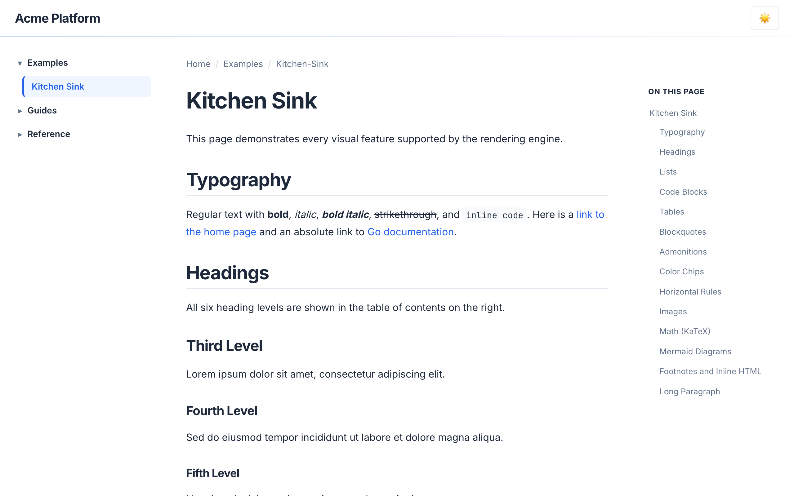
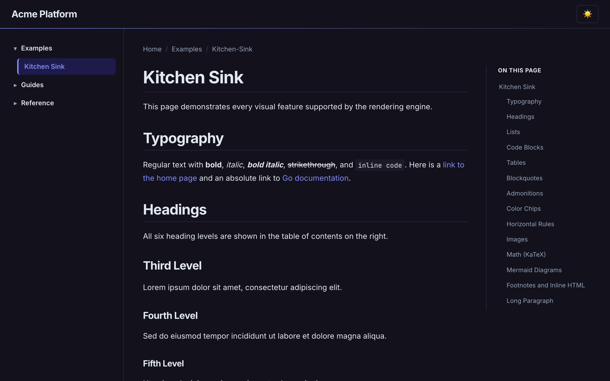

# Default

The default gomddoc theme. A clean, modern documentation layout with a left navigation sidebar,
right-hand table of contents, and full dark mode support. Uses Inter for body text and JetBrains
Mono for code.

Light mode uses a crisp white background with blue accents. Dark mode switches to a deep
purple-tinted background with indigo highlights and a subtle gradient border on code blocks.

Features sticky header with backdrop blur, breadcrumb navigation, collapsible nav sections,
scroll-tracked TOC highlighting, and copy-to-clipboard buttons on code blocks. Admonitions use
color-coded left borders with tinted backgrounds. Responsive layout hides the TOC on tablets and
collapses the nav sidebar into a hamburger menu on mobile.

