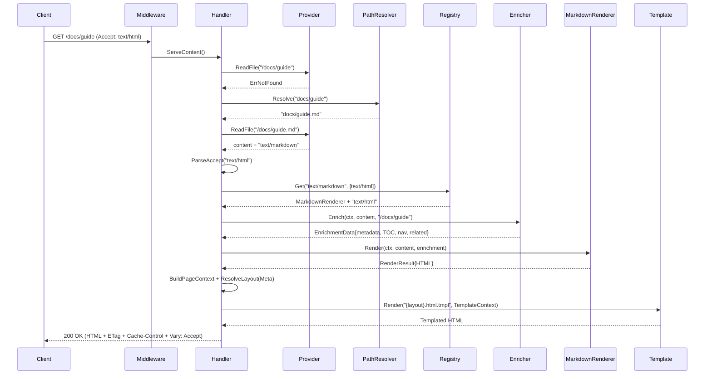
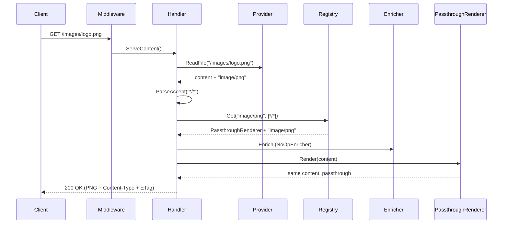

# Gomddoc Architecture

## Overview

Gomddoc is a production-ready HTTP server built with a clean, interface-driven architecture for serving documentation
with automatic content rendering. The system supports both local filesystem and remote Git repositories as content
sources. It is designed for extensibility, testability, and HTTP compliance.

## Architecture Diagram

```mermaid
graph TD
    A[HTTP Request] --> B["Middleware (outermost first)<br/>1. SecurityHeaders<br/>2. RequestID<br/>3. Compression<br/>4. Metrics<br/>5. BasicAuth<br/>6. MethodFilter<br/>7. ContentExclusion<br/>8. ExtensionRedirect"]
    B --> C["Handler<br/>ServeContent()"]
    C --> D["Provider<br/>ReadFile"]
    C --> RES["PathResolver<br/>Resolve (on not found)"]
    RES --> D
    C --> E["Registry<br/>Get"]
    C --> EN["Enricher<br/>Enrich"]
    C --> F["Template<br/>Render"]
    E --> G["Renderer<br/>Render"]
    D --> H[HTTP Response]
    EN --> G
    G --> H
    F --> H

    MCP["MCP Client<br/>(Claude, Cursor, etc.)"] -->|"JSON-RPC<br/>(stdio / HTTP)"| MCPS["MCP Server<br/>internal/mcp/"]
    MCPS --> D
    MCPS --> MI["Metadata Index"]
    MCPS --> SI["Search Index"]
    MCPS --> NAV["Navigation"]
```



## Package Map

| Package | Job |
| --- | --- |
| `cmd/gomddoc` | Kong CLI, pipeline assembly (`pipeline.go`), static build (`build.go`), embedded assets (`assets/`) |
| `docs` (`docs/guide.go`) | Embeds `docs/guide/` as `docs.Guide`, the user guide served by `help`, `info` and MCP |
| `internal/assets` | Overlays a site's `.gomddoc/` over the embedded assets (`BuildFS`) and builds the static-asset FS (`BuildStaticFS`) |
| `internal/capabilities` | Assembles one `Report` (settings, commands, frontmatter fields, theme features, guide pages) for `info` and MCP |
| `internal/config` | Config loading (flags > env > YAML > defaults), validation, `Schema`/`JSONSchema`, `Inspect` for doctor |
| `internal/diag` | `Finding` type and code `Catalogue`; producers return findings, callers log them with `diag.Log` |
| `internal/doctor` | Site checks behind `gomddoc doctor` and the `gomddoc_doctor` MCP tool |
| `internal/enricher` | Pre-rendering extraction: frontmatter, TOC, navigation, prev/next, related documents |
| `internal/guide` | The embedded guide as topics: list, read, read one section, search |
| `internal/locale` | Language-directory detection (`DetectLanguages`) and UI string bundles (`Bundle`) |
| `internal/mcp` | Model Context Protocol server: tools, resources, prompts, and the `gomddoc://` self-documentation |
| `internal/metadata` | Frontmatter index, tag lookups, `FrontmatterFields` |
| `internal/negotiate` | Accept-header parsing (`ParseAccept`, `MediaType.Specificity`), MIME detection and the `.md` MIME registration |
| `internal/provider` | Content sources (filesystem, Git, overlay), exclusion predicates, `fs.FS` implementations |
| `internal/renderer` | Renderer registry, Markdown→HTML (goldmark + custom extensions), passthrough renderers |
| `internal/resolve` | Clean-URL ↔ real-path mapping (`PathResolver`, `PageURLPath`) |
| `internal/search` | Inverted index, TF-IDF ranking, snippets, `tag:` filters |
| `internal/seo` | Canonical URLs (`PageURL`), JSON-LD (`GenerateJSONLD`), `LastModified` |
| `internal/server` | HTTP server, `RouteGroup`, middleware, content/tag/API/XML handlers, error pages, admin listener |
| `internal/template` | HTML rendering, template cache, `PageContext`, theme feature scan; subpackages `breadcrumb` and `navigation` |
| `internal/text` | Title derivation and casing, frontmatter stripping, section extraction, log sanitization (`text.Safe`), `Closest` |
| `internal/testutil` | Test-only helpers: `countfs`, `fanout`, `logcapture`, `markdown`, `provider`, `registry`. Excluded from coverage via `.covignore` |

## Commands

Each subcommand lives in its own file under `cmd/gomddoc/`.

| Command | File | What it assembles |
| --- | --- | --- |
| `serve` | `serve.go` | `setupServer` → `setupLanguagePipelines` (cache unless dev mode, navigation, metadata, search), `server.NewHTTPServer`, optional `AdminServer`, MCP over HTTP at `/_mcp/` |
| `preview` | `preview.go` | Same `setupServer` path with `DevMode: true` and `--port :auto`; `--open` opens a browser |
| `build` | `build.go` | `setupLanguagePipelines` (cache, navigation, metadata; no search index), static walk into `--output` |
| `mcp` | `mcp.go` | `setupPipeline` (cache, navigation, metadata, search) for the root content only, stdio MCP server with `SelfDocs` |
| `doctor` | `doctor.go` | `config.Inspect` + `setupLanguagePipelines` (metadata, `ReportOnly`) → `doctor.Run` |
| `info` | `info.go` | `capabilities.Describe` rendered as text, or `Report.JSON()` with `--json` |
| `help` | `help.go` | `internal/guide` over `docs.Guide`: topic list, topic or section read, `--search` |
| `schema` | `schema.go` | Prints `config.JSONSchema()` |
| `init` | `init.go` | Writes `.gomddoc/config.yml` (title from the directory name, `--theme`) via `yaml.Marshal` |

## Core Components

### 1. Provider Layer

**Responsibility:** File I/O, MIME type detection, directory handling

```go
type Provider interface {
    ReadFile(ctx context.Context, path string) (content []byte, mimeType string, err error)
    Stat(ctx context.Context, path string) (fs.FileInfo, error)
    DefaultIndex() string
    RootFS(ctx context.Context) (fs.FS, error)
    io.Closer
}
```

**Implementations:**

- **FilesystemProvider** — Local filesystem via `os.DirFS()`. `NewFilesystemProviderFromFS` wraps any `fs.FS`; each
  language pipeline uses it over `fs.Sub(contentRoot, lang)`, which works for Git sources too.
- **GitProvider** — Remote Git repositories (`git://`, `git+ssh://`, `git+https://`) via go-git with a configurable
  storage backend.
- **OverlayProvider** — Wraps a provider with a fallback `fs.FS`. Every pipeline's `Provider` is
  `NewOverlayProvider(prov, staticFS)`, so a request for a path the content does not have (for example `/favicon.ico`)
  falls back to the static-asset layers.

`NewProvider()` picks Git or filesystem with `config.IsGitURL`. All three share `normalizePath()` for converting request
paths to fs-compatible paths. Provider errors are `*provider.PathError` wrapping a sentinel (`ErrNotFound`,
`ErrDirListingDisabled`, the `ErrGit*` family, `ErrFileTooLarge`); the `fs.FS` implementations return `*fs.PathError`
through the single `fsPathErr` helper.

**URL Resolution:**

The `internal/resolve` package provides the `PathResolver`, built once per pipeline by `resolve.Build` and immutable
afterwards. It maps clean URLs to real files and back:

- **Extensionless URLs**: Maps `/docs/guide` to `docs/guide.md` when `.md` is configured for stripping
- **Collision handling**: Earlier entries in `strip_extensions` win; collisions are returned as findings
  (`Findings()`), not logged by the resolver
- **Renderable files only**: A file is mapped only when `BuildOptions.HasRenderer` reports an HTML renderer for its MIME
  type
- **Exclusions**: Hidden and `exclude`-matched files get no mapping at all, so they are unreachable at their clean URL
  as well as their real path

The 301 from `/docs/guide.md` to `/docs/guide` is issued by the `ExtensionRedirect` middleware, which consults the
resolver.

```go
type PathResolver struct {
    toReal   map[string]string // extensionless -> real file path
    toClean  map[string]string // real file path -> extensionless
    findings []diag.Finding    // unreadable subtrees and clean-path collisions
}

type BuildOptions struct {
    StripExtensions []string       // priority order: earlier wins collisions
    Exclude         []string       // path.Match patterns with no mapping
    HasRenderer     RendererCheck  // func(mimeType string) bool
}
```

Methods: `Resolve(cleanPath)`, `CleanPath(realPath)`, `PageURLPath(realPath, defaultIndex)`, `AllMappings()`,
`IsEmpty()`, `Findings()`. `strip_extensions` defaults to `[".md"]`, `exclude` to `[]`.

`PageURLPath(realPath, defaultIndex)` runs that mapping in the **reverse** direction — file path to
published URL — and is the single implementation of it. Serve mode never needs it (it is handed a
URL and resolves backwards to a file), but build mode walks files, and anything holding a real path
and rendering a link needs it: `buildFile`'s `Page.Path`, the `contentURL` template function
(see-also entries), the sitemap and feed generators, and `navigation.buildTree` — which is the
*producer* of the clean paths `Page.Path` is later matched against for prev/next and sidebar state.
Deriving it ad hoc is what let static builds advertise a `.md` canonical URL while the same build's
sitemap advertised the clean one. Default-index files fold to their directory (`guides/README.md` →
`/guides`, root → `/`); a nil receiver degrades to the real path. It describes the **serve** URL
scheme: build's `prettyOutputPath` independently decides where HTML is *written*, and the two are not yet reconciled
for `strip_extensions: []` or directories holding both `README.md` and `index.md`.

The `exclude` patterns are load-bearing here, not just an optimization: the `ContentExclusion`
middleware matches the *request* path, which no longer carries the extension, so a pattern like
`TODO.md` cannot match a request for `/TODO`. Every content index — `resolve.Build`,
`metadata.BuildIndex`, `navigation.NewGenerator`, `search.BuildIndex` — and build's static walk are therefore given
the same list, `Pipeline.Exclude`.

**Git Storage Backends:**

- **MemoryStorageFactory** (default) — In-memory clone for fast startup and small repos
- **DiskStorageFactory** — Filesystem-backed storage via `--git-storage-dir` for large repos that would OOM with
  in-memory storage. `buildGitConfig` places each source in a subdirectory named after a SHA-256 prefix of its URL.

**Key Features:**

- stdlib `fs.FS` compatible paths (forward slashes, no leading `/`)
- Directory listings off by default (`dir_index: false`); a directory without an index file then redirects (302) to
  the first page under it in the navigation tree, or answers 403
- Hidden file filtering in directory listings
- Safe resource lifecycle: `RootFS()` returns `gitTreeFS` backed by shared `gitTreeState` — `Close()` invalidates all
  outstanding FS references via mutex-protected nil, preventing use-after-close and breaking the reference chain for GC
- **Git reads are serialised**: `gitTreeState` owns the cached tree behind an *exclusive* mutex, and it is the only
  synchronisation point for the git object graph. `GitProvider.ReadFile`/`Stat` and every `gitTreeFS` share it. This is
  a correctness requirement — go-git memoises `object.Tree` lookups into unsynchronised maps and its storers mutate on
  read, so an `RWMutex` would let two "readers" hit a concurrent map write (an unrecoverable runtime throw). The only
  safe way to parallelise is N independent repo handles
- **Because reads serialise, each one is kept to the minimum object access.** `gitTreeState` carries the tree's own
  object storer alongside the tree (published and cleared together), which lets both surfaces answer from a hash the
  path walk already produced: `resolveTreeNode` walks a path once and switches on the entry's mode instead of probing
  with `tree.File`, `statTreeNode` sizes a blob from its header instead of decoding it, and `blobBytes` reads a blob
  into one exact-size allocation. `gitTreeFS` implements `fs.StatFS` and `fs.ReadFileFS` for the same reason — the
  `io/fs` fallbacks route both through `Open`, which decodes the whole blob (sitemap and feed generation stat every
  page; the metadata and search index builds read every file)
- **Not-found mapping is narrow**: `isMissingGitObject` and `treeErr` map only missing-object errors to
  `fs.ErrNotExist`; any other failure surfaces as itself, so a corrupt repository produces a 500 rather than a 404
- Clone timeout 60s and a 50 MB per-file limit (`GitProviderConfig.CloneTimeout`, `MaxFileSize`)

### 2. Renderer Layer

**Responsibility:** Content transformation with MIME-type routing

```go
type ContentRenderer interface {
    InputMimeTypes() []string
    OutputMimeTypes() []string
    Render(ctx context.Context, content []byte, enrichment *enricher.EnrichmentData) (*RenderResult, error)
}

type RenderResult struct {
    Content  []byte
    MimeType string // empty means "preserve the input MIME type"
}
```

Renderers declare both input and output MIME types, enabling two-dimensional content negotiation
(input type from the file + output type from the client's Accept header). Metadata and TOC are
provided by the enricher pipeline, not the renderer.

**Built-in Renderers:**

| Renderer | InputMimeTypes | OutputMimeTypes | Purpose |
| --- | --- | --- | --- |
| **MarkdownPassthroughRenderer** | `["text/markdown"]` | `["text/markdown"]` | Raw markdown with frontmatter stripped |
| **MarkdownRenderer** | `["text/markdown"]` | `["text/html"]` | Markdown → HTML with goldmark extensions |
| **PassthroughRenderer** | `["*/*"]` | `["*/*"]` | Catch-all, content unchanged |

Registration order matters: later registrations win ties. `setupPipeline` registers MarkdownPassthroughRenderer
first, then MarkdownRenderer (so HTML is the default for `Accept: */*`), then PassthroughRenderer.

**Goldmark Extensions:**

Three custom goldmark extensions operate at the AST level during parsing and rendering:

1. **Heading Anchors** (`HeadingAnchorExtension`) — Custom `NodeRenderer` for `ast.KindHeading` that appends a
   `<gmd-heading-anchor href="#id">` web component to headings with auto-generated IDs. Gated by `heading_anchors`.
2. **Admonitions** (`AdmonitionExtension`) — AST transformer that detects
   `[!NOTE]`/`[!TIP]`/`[!IMPORTANT]`/`[!WARNING]`/`[!CAUTION]` patterns in blockquotes and replaces them with
   `AdmonitionNode` custom AST nodes, rendered as `<gmd-admonition type="..." title="...">` elements. Gated by
   `admonitions`.
3. **Color Chips** (`ColorChipExtension`) — AST transformer that detects hex color codes in `ast.CodeSpan` nodes and
   replaces them with `ColorChipNode` custom AST nodes, rendered as `<gmd-color-chip>#HEX</gmd-color-chip>`. Gated by
   `color_chips`.

Feature flags are passed to extensions via two channels: the parser context key (for AST transformers) and a document
attribute (for node renderers). This enables per-page feature overrides via frontmatter. All extensions are always
registered on the goldmark instance — disabled extensions skip transformation, leaving the original AST nodes to
render with goldmark's defaults. `meta.Meta` is also registered: it strips the frontmatter from the HTML output.

### 3. Registry

**Responsibility:** Two-dimensional renderer selection (input type + Accept header)

```go
type RendererRegistry interface {
    Register(renderer ContentRenderer)
    Get(inputMimeType string, accepted []negotiate.MediaType) (ContentRenderer, string, error)
    AvailableOutputTypes(inputMimeType string) []string
}
```

**Selection algorithm (`DefaultRegistry.Get`):**

1. Keep entries whose `InputMimeTypes()` match the input (exact=3 > type/*=2 > */*=1). None → `ErrNoRenderer` (415)
2. For each accepted type in q-value order, score each candidate output type as `inputScore*10 +
   MediaType.Specificity()`; `*/*` outputs resolve to the input MIME type first
3. Return the best match at the first q-level that has one; on a tie, the latest registered wins
4. Return `ErrNoMatchingRenderer` if no output matches (→ 406 Not Acceptable)

Thread-safe with `sync.RWMutex`. Storage is an ordered `[]registryEntry`, not a map.

### 4. Enricher Layer

**Responsibility:** Pre-rendering structured data extraction

```go
type Enricher interface {
    SupportedMimeTypes() []string
    Enrich(ctx context.Context, content []byte, path string) (*EnrichmentData, error)
}

type EnrichmentData struct {
    Metadata    map[string]any
    Features    map[string]bool // Page-level feature overrides from frontmatter
    TOC         *TOCNode
    Navigation  *NavTree
    RelatedDocs []RelatedDoc
    PrevPage    *PageLink       // Previous page in navigation order
    NextPage    *PageLink       // Next page in navigation order
}
```

The enricher runs before rendering to extract metadata, TOC, navigation, and related documents from
content. This decouples structured data extraction from output format — both HTML and markdown
renderers receive the same enrichment data.

`RelatedDocs` is the one part of enrichment whose cost scales with the *site*, not the page: it runs
on every markdown request and once per file in a static build, and a tag applied site-wide makes
every other page a candidate. `findRelatedDocs` therefore streams candidates through
`Index.PagesByTag` (an `iter.Seq[*PageInfo]`, no copy) into a sorted window of `maxRelatedDocs` (10), dropping
anything ordered after the window's worst without recording it. Allocation is flat in corpus size; see
`BenchmarkMarkdownEnricher_RelatedDocs`.

**Built-in Enrichers:**

| Enricher | MIME Types | Extracts |
| --- | --- | --- |
| **MarkdownEnricher** | `text/markdown` | Frontmatter, TOC, navigation, prev/next, related docs via metadata index |
| **NoOpEnricher** | _(fallback)_ | Empty `EnrichmentData{}` |

`MarkdownEnricherOptions` carries the whole-tree pieces as injected values: `MetaIndex`, `NavBuilder` and
`PrevNextBuilder`. Each is optional; a nil one leaves that part of `EnrichmentData` empty.

The `DefaultEnricherRegistry` is MIME-type-keyed and always returns an enricher (`Get()` never returns nil).
Uses `sync.RWMutex` for thread safety.

### 5. Handler Layer

**Responsibility:** HTTP orchestration and content negotiation

**Flow (`Handler.ServeContent`):**

1. If the path is a `redirect_from` source in `URLRedirects`, answer 301 to its target
2. Read the file + MIME type from the Provider at the request path
3. On `ErrNotFound`, ask the PathResolver for the real file behind the clean URL and read that
4. On `ErrDirListingDisabled`, redirect (302) to the first page under the directory via `RedirectFinder`, if there is
   one
5. Parse Accept → 2D registry lookup (input type + accepted output). No match → plain-text 406 listing
   `AvailableOutputTypes`
6. Enrich content (metadata, TOC, navigation, prev/next, related docs)
7. Render content with enrichment data
8. Add `Vary: Accept`; serve through `serveWithETag` — wrapped in the layout from `ResolveLayout` if the output is
   HTML, raw otherwise

Errors go through `classifyError` and the scope's `ErrorPage`.

### 6. Template Layer

**Responsibility:** HTML template rendering with caching and breadcrumbs

```go
type Renderer interface {
    Render(ctx context.Context, templateName string, data any) ([]byte, error)
    HasTemplate(name string) bool
    RenderTagPage(ctx context.Context, lang string, tFunc func(string) string, tag string, pages []metadata.PageInfo) ([]byte, error)
    RenderTagsIndex(ctx context.Context, lang string, tFunc func(string) string, tags []TagCount) ([]byte, error)
    Breadcrumbs(path string) []breadcrumb.Breadcrumb
}
```

`HTMLRenderer` implements it. Templates receive a `TemplateContext` (`Site`, `Page PageContext`, plus the bound
language, translator and language list behind `.T`, `.Lang` and `.Languages`).

**Features:**

- Embedded themes via `embed.FS` with an overlay filesystem for customization
- Production mode: `CachedTemplateStore` (`sync.Map` cache) with `singleflight` to coalesce concurrent cache-miss
  parses; `WithCache` also turns on the inline-asset cache
- Dev mode (`dev_mode`, always on for `preview`): `PassthroughTemplateStore` (always re-parse)
- `bytes.Buffer` pool; buffers above 64 KB are not returned to the pool
- `ValidateDefaultTheme` fails startup when `assets/themes/default/layouts/default.html.tmpl` is missing
- Options: `WithCache`, `WithBreadcrumbGenerator`, `WithResolver`, `WithLangPrefix`, `WithSearchIndex` (enables the
  JSON-LD `SearchAction`)

**Template Functions:**

The FuncMap (`renderer.go:funcMap`) has exactly these twelve entries:

| Function | Signature | Purpose |
|----------|-----------|---------|
| `toc` | `toc(tocTree, [min, max]) → []*TOCNode` | Returns filtered TOC nodes for template rendering (default: h1-h2) |
| `editURL` | `editURL(pagePath) → string` | Combines `edit_url` config with page path |
| `themeVarsCSS` | `themeVarsCSS() → CSS` | `:root` block of `--theme-*` CSS custom properties from `theme.vars` |
| `canonicalURL` | `canonicalURL(pagePath) → string` | Absolute URL for `<link rel="canonical">` / OG tags (`seo.PageURL`) |
| `jsonLD` | `jsonLD(page) → JS` | Structured-data payload for the page (`TechArticle`, `BreadcrumbList`, `WebSite`) |
| `assetURL` | `assetURL(name) → string` | Prefixes a static file name with `/_assets/` |
| `contentURL` | `contentURL(filePath) → string` | Absolute URL path for a content file — applies `PageURLPath` *and* the renderer's language prefix |
| `inlineJSAsset` | `inlineJSAsset(name) → JS` | Loads asset as `template.JS` for `<script>` embedding |
| `inlineCSSAsset` | `inlineCSSAsset(name) → CSS` | Loads asset as `template.CSS` for `<style>` embedding |
| `inlineHTMLAsset` | `inlineHTMLAsset(name) → HTML` | Loads asset as `template.HTML` for HTML context (e.g. SVGs) |
| `tagURL` | `tagURL(lang, tag) → string` | URL of a tag page, language-prefixed unless `lang` is the site default |
| `pageTags` | `pageTags(meta) → []string` | A page's frontmatter tags, normalized and deduplicated like the metadata index, in frontmatter order |

Functions degrade rather than fail when their input is missing: `canonicalURL` and `jsonLD` return empty without
`meta.domain`, and `contentURL` falls back to the real path without a resolver. The `inline*Asset` functions look in
the active theme's directory, then `assets/shared/`, and return an error (failing the render) when neither has the
file.

`.Feature name`, `.T key`, `.Lang` and `.Languages` are **not** in this table: they are methods on `TemplateContext`,
not FuncMap entries, so they are called on the dot rather than as bare functions.

Neither breadcrumbs nor navigation is a template function either — both are `PageContext` fields. The
rule is that anything more than one consumer reads must be a field: `funcMap` is bound at parse time
and parsed templates are cached and shared across concurrent `Render` calls, so there is no
per-render seam where a memo could live, and a function with two callers in a layout does its work
twice per request.

The breadcrumb trail is page data, like the TOC and the navigation tree: `BuildPageContext` calls
`Renderer.Breadcrumbs(in.Path)` once and stores the result on `PageContext.Breadcrumbs`, which both the layout's
breadcrumb bar and the JSON-LD `BreadcrumbList` read. The trail comes from `internal/template/breadcrumb`, whose
generator costs a provider `Stat` for the trailing segment. Callers pass the renderer (`PageContextInput.Renderer`)
rather than a precomputed trail, so the trail and `Path` cannot disagree. Error pages have no trail:
`BuildErrorContext` leaves the field nil.

### 7. Navigation Layer

**Responsibility:** Auto-generated sidebar navigation from content structure

Two types, one per side of the cache boundary. `navigation.NavNode` is the *shared* tree, built
once behind a `sync.Once` and reused across requests, so it carries nothing request-specific:

```go
type NavNode struct {
    Label    string
    Path     string
    IsDir    bool
    Children []*NavNode

    cleanPath string // normalized Path, pre-computed for active-path comparison
}
```

`enricher.NavItem` is the per-request projection templates actually range over — the same tree with
the current page marked:

```go
type NavItem struct {
    Title    string
    Path     string
    IsDir    bool
    Active   bool // on the current page's path
    Open     bool // this node or a descendant is active
    Children []NavItem
}
```

`navigation.NewGenerator(rootFS, defaultIndex, exclude, resolver)` walks the content root to build a tree of all
`.md` files, skipping restricted paths (`provider.IsRestrictedPath`). Leaf labels come from the metadata index's
frontmatter title (`SetTitleLookup(MetaIndex.TitleForPath)`), then the file's first `# heading` (skipping YAML
frontmatter), then the title-cased file name. Leaf paths come from `PageURLPath`. All entries (directories and files)
are sorted alphabetically and interleaved. The default index file (e.g., `README.md`) is excluded from the tree. Empty
directories are pruned.

Navigation data flows through the enricher pipeline: `setupPipeline` wraps the generator in three adapters —
`navBuilderAdapter` (`NavBuilder`), `prevNextBuilderAdapter` (`PrevNextBuilder`) and `redirectFinderAdapter`
(`server.RedirectFinder`, backed by `FindFirstPage`) — so `enricher` does not import `navigation`. The tree is stored
in `EnrichmentData.Navigation` and passed to the template layer via `PageContext.Navigation`. Themes render it
themselves: the default theme's `partials/nav.html.tmpl` defines a `nav-item` template that recurses over
`.Children`, emitting `<details>/<summary>` for directories and `<a>` for files.

### 8. Metadata Index

**Responsibility:** Aggregate frontmatter metadata across all pages

```go
type Index struct {
    pages  []PageInfo
    byTag  map[string][]int // tag -> page indices
    byPath map[string]int   // path -> page index
}
```

Built at startup by `metadata.BuildIndex(ctx, rootFS, exclude)`, walking the content root and parsing YAML
frontmatter concurrently with `errgroup` (three-phase: collect paths → parse in parallel → merge sequentially). Uses a
lightweight `---` delimiter parser, no full goldmark render. An unreadable file is skipped with a `Warn`; malformed
frontmatter is skipped at `Debug`.

The index is immutable after construction, and its accessors come in two flavours that say so.
`AllPages`, `ByPath`, `ByTag` and `LookupTag` hand back a **deep** copy — `clonePage` clones the
`Tags` slice and the `Meta` map, because a bare struct copy would share both with the index. The
`PagesByTag` iterator and `TitleForPath` are the zero-copy siblings: they read in place, and the
caller must not retain or mutate what they yield. Pick the iterator whenever the loop reads a field
or two and keeps nothing — `search.taggedPages`' multi-tag intersection and MCP's related-pages
lookup both do. Pick the slice when the caller owns the result: `search.taggedPages` runs
`slices.DeleteFunc` over its first tag's pages and later rewrites their `Title`/`Description`.
`AllTags` returns the sorted tag list and `CountByTag` a count without allocating.

Exposed via JSON API:

- `GET /api/tags` — All tags (sorted)
- `GET /api/tags/{tag}` — Pages with the given tag

**`LookupTag` is the one answer to "is this a known tag".** Four entry points take a tag from
outside the index — `/tags/{tag}`, `/api/tags/{tag}`, the MCP resource `docs://site/tag/{tag}`, and
build's `emitTagPages` — and three of them once answered differently for an unknown one (themed 404,
200 with `[]`, and a *successful* read of JSON `null`). `Index.LookupTag(tag) ([]PageInfo, bool)`
owns the length bound (`MaxTagLength`), the `normalizeTag` lookup, the emptiness verdict, and the
title sort, so each caller only chooses how to *render* the miss. The sort belongs there too: it is
why the JSON array, the HTML page and the static build list a tag's pages in the same order.

`ByTag`, `PagesByTag` and `CountByTag` normalize their argument the same way `BuildIndex` keys the
map. They must — lowercasing alone missed an indexed `go` when the request said `%20go`. `NormalizeTags` applies the
same rule to a page's raw `tags` value, for chips and links.

### 9. Search Index

**Responsibility:** Full-text search across all documentation pages

```go
type Index struct {
    docs          []document
    inverted      map[string][]posting
    docTermCounts []int // body token count per doc, for TF normalization
    docCount      int
    metaIndex     *metadata.Index // tag filters resolve here
    pathToDoc     map[string]int
}
```

Built at startup by `search.BuildIndex(ctx, rootFS, metaIndex, exclude)` after the metadata index, using the same
3-phase concurrent pattern, and only when `search.index` is true. Tokenizes markdown content (stripped of syntax) into
a unified inverted index where each posting carries a field tag (`fieldBody`, `fieldTitle`, `fieldDesc`). Title and
description are tokenized through the same pipeline as body content. Ranking uses per-field TF-IDF: body uses
standard TF*IDF, a title hit adds 3×IDF, and a description hit adds 1.5×IDF. IDF is precomputed once per query token.
Queries use AND semantics: every query token must appear in at least one field of the document. `tag:<name>` tokens
are filters resolved against the metadata index (AND across tags); a tag-only query lists the tagged pages by title.
Snippet generation highlights matched terms with `<mark>` tags.

Phase 3 appends documents one at a time, so every posting list ends up sorted ascending by `docIdx`
with a document's body/title/desc postings consecutive. Querying depends on that: document frequency,
the AND intersection, and scoring are all linear merges over the posting lists and the (ascending)
candidate list, so no per-query map is built and a token matching the whole corpus costs one pass.
Ranking keeps a sorted top-`limit` window rather than sorting every candidate. Results are ordered by score
descending with `docIdx` ascending as a tiebreaker, so equally-scored hits list identically on every run.

Exposed via JSON API:

- `GET /api/search?q=<query>&limit=<n>&lang=<code>` — Full-text search with ranked results. `limit` defaults to 20
  and is capped at 100; `q` is truncated to 500 bytes. With language pipelines, `NewMultiLangSearchHandler` picks
  the index by `?lang=` > `Accept-Language` > default language (`ResolveAPILanguage`).

**Search UI:** A shared `search.mjs` module (loaded via `inlineJSAsset`) provides a search modal across
all themes. Opens via Ctrl+K / Cmd+K or a header search button. Debounced fetch to `/api/search` (`limit=10`),
keyboard navigation (arrow keys + Enter, Escape), and highlighted snippets. CSS uses theme custom properties
(`--color-bg`, `--color-text`, `--color-primary`, etc.) for cross-theme compatibility. The modal is gated by the
`search` feature. `gomddoc build` builds no search index, so a static site has no `/api/search`.

### 10. MCP Server

**Responsibility:** AI-native documentation access via the Model Context Protocol

```go
type ServerDeps struct {
    Provider        provider.Provider
    MetaIndex       *metadata.Index
    SearchIndex     *search.Index
    NavGenerator    *navigation.Generator // the pipeline's, shared — never rebuilt here
    ExcludePatterns []string              // cfg.Site.Exclude, gates direct reads
    SelfDocs        *SelfDocs             // gomddoc:// namespace; set by `gomddoc mcp` only
    Version         string
}

type SelfDocs struct {
    Report capabilities.Report // built once at startup
    Guide  fs.FS               // docs.Guide, the embedded user guide
    Doctor func(ctx context.Context, verbose bool) doctor.Report // nil leaves gomddoc_doctor unregistered
}

func NewServer(deps ServerDeps) *MCPServer
func (s *MCPServer) Run(ctx context.Context) error       // stdio transport
func (s *MCPServer) HTTPHandler() http.Handler            // Streamable HTTP
```

The MCP server is a thin adapter that exposes gomddoc's existing internals — Provider, Metadata Index,
Search Index, and Navigation — via the MCP protocol. No new parsing or indexing logic is introduced.
It builds none of them: every index and the navigation generator arrive from the pipeline that already
built them, so `get_table_of_contents` reads a tree cached behind a `sync.Once` instead of re-walking
the content per call. `gomddoc mcp` therefore sets `EnableNavigation: true` on its pipeline. Every entry point that
reads a path runs it through `provider.IsRestrictedPath` first.

Uses the official Go MCP SDK (`github.com/modelcontextprotocol/go-sdk`). Supports two transports:
stdio (`gomddoc mcp`, for local clients like Claude Desktop/Cursor) and Streamable HTTP (mounted by `serve` at
`/_mcp/`, built by `siteMCPServer`).

**Capabilities:**

| Category | Items |
|----------|-------|
| **Tools** (6) | `search_docs`, `read_page`, `list_pages`, `get_table_of_contents`, `read_section`, `find_related` |
| **Resources** (4) | `docs://site/index`, `docs://site/tags`, `docs://site/page/{+path}`, `docs://site/tag/{tag}` |
| **Prompts** (3) | `explain_concept`, `troubleshoot`, `summarize_page` |

All tools are annotated with `readOnlyHint: true` and `idempotentHint: true` for auto-approval trust.

**Self-documentation (stdio only):** when `SelfDocs` is set, the server also registers the resources
`gomddoc://capabilities`, `gomddoc://schema/config` and `gomddoc://guide/{+path}`, the tools `gomddoc_capabilities`,
`gomddoc_guide` and (when `SelfDocs.Doctor` is set) `gomddoc_doctor`, and the `learn_gomddoc` prompt. `gomddoc mcp`
sets it; `serve`'s `/_mcp/` server leaves it nil — a public site's readers have no use for the generator's manual.
Guide access goes through `internal/guide`, whose topic list is the allowlist; its search index is built lazily
(`sync.OnceValues`) on the first search.

**Section Extraction:** The `read_section` tool provides sub-page access by heading anchor ID through
`text.ExtractSection`, a line-based algorithm that extracts content between headings without goldmark. Its
`slugifyHeading()` matches goldmark's auto-heading-ID behavior. `internal/guide` uses the same function for
`gomddoc help <topic> <section>` and `gomddoc_guide`.

### 11. Static Site Generator

**Responsibility:** Build static HTML from content for deployment to static hosts

The `gomddoc build` command reuses the same provider → renderer → template pipeline as `serve`. It refuses to write
into a non-empty output directory that lacks its `.gomddoc-build` sentinel (`guardOutputDir`), then walks the content
root via `fs.WalkDir` (skipping `Pipeline.Exclude` through `provider.SkipWalkEntry`). Every file with an HTML renderer
is rendered through the full pipeline; everything else is copied as-is. `prettyOutputPath` writes `guide.md` as
`guide/index.html`, `index.md` as `index.html`, and the default index as its directory's `index.html` unless the
directory also has an `index.md`. File processing is parallelized with an `errgroup` worker pool bounded by
`runtime.NumCPU()`, and counts accumulate into one shared `*buildStats`.

Besides the pages, build writes the static-asset overlay to `_assets/`, `robots.txt`, `sitemap.xml` and `feed.xml`
(when `meta.domain` is set), `sitemap-index.xml` (see below), `redirect_from` stub pages, extension redirect stubs
(`guide.md` → `/guide`), tag pages (`tags/index.html`, `tags/{tag}/index.html`), and `404.html` rendered through
`ErrorPage.Render`.

### 12. Middleware Chain

Middleware is applied in layers using `RouteGroup` (`NewGroup`, `Subgroup`, `Handle`, `HandleFunc`) for structured
route registration. A subgroup inherits its parent's middleware and appends its own, so a concern belongs on the
highest group that wants it — attaching it to a leaf means every sibling added later silently opts out.

**Shared middleware (wraps the whole mux):**

1. **SecurityHeaders** — Sets `X-Content-Type-Options: nosniff`, `X-Frame-Options: DENY`,
   `Referrer-Policy: strict-origin-when-cross-origin`, `Permissions-Policy`, and HSTS on TLS requests
2. **RequestID** — Assigns (or accepts a valid incoming) `X-Request-ID` for tracing

**`base` group middleware (applied to every user-facing route):**

3. **Compression** — Gzip with smart thresholds (min 1KB, skips images/video/audio/archives, SVG exception). The
   decision precedes the copy: a write that takes the response past 1KB is committed and encoded straight through,
   and only the sub-threshold prefix before it was ever buffered. The pooled buffer is therefore fixed at 1KB and
   never re-grown, so `returnBuf` hands the pointer back untouched. Sets `Vary: Accept-Encoding` unconditionally,
   including on responses it leaves uncompressed.
4. **Metrics** — Prometheus counters and histograms (`http_requests_total`, `http_request_duration_seconds`)

**`auth` subgroup middleware:**

5. **BasicAuth** — HTTP Basic Authentication via htpasswd file (`--basic-auth-file`, bcrypt hashes only). Inside
   Compression and Metrics, so 401s are counted.

**Content-specific middleware (applied to content handlers via Subgroup):**

6. **MethodFilter** — Returns 405 Method Not Allowed for non-GET/HEAD requests with `Allow` header
7. **ContentExclusion** — Blocks hidden files (dot-prefixed, except `.well-known` per RFC 8615) and user-configured
   exclusion patterns with a 404. Uses `provider.IsRestrictedPath()` — `IsHiddenPath() || IsExcludedPath()` — which
   is also what every MCP tool, resource and prompt calls, so both entry points restrict the same set of paths. This
   middleware matches the *request* path: with `strip_extensions` on, `/TODO` does not match the `TODO.md` pattern,
   which is why exclusion also has to be enforced in each content index rather than here alone. Its 404 is written
   through the same `ErrorPage` as the handler it wraps — see [Error Responses](#error-responses).
8. **ExtensionRedirect** — Redirects requests with stripped extensions (e.g., `/docs/guide.md` → `/docs/guide`) via
   301.

Metrics wrapping these three means their 405/404/301 responses are counted too, not just handler hits.

**Route groups (main listener):**

| Group | Prefix | Middleware | Routes |
|-------|--------|-----------|--------|
| health | `/health` | _(none)_ | `/live`, `/ready` |
| _(own group)_ | | BasicAuth (if configured) | `/metrics` — only when admin endpoints share the main port |
| _(own group)_ | `/debug/pprof` | BasicAuth (if configured), applied by `mountPprof` | `/`, `/cmdline`, `/profile`, `/symbol`, `/trace` — only with `--pprof` and admin on the main port |
| base | | Compression, Metrics | `/robots.txt`, `/_assets/` |
| base → auth | | BasicAuth (if configured) | `/sitemap.xml`, `/feed.xml`, `/tags/`, `/tags/{tag}`, `/_mcp/` |
| auth → api | `/api` | _(inherits auth)_ | `/tags`, `/tags/{tag}`, `/search` |
| auth → content | | MethodFilter, ContentExclusion, ExtensionRedirect | `/` (catch-all) |

`/sitemap.xml` and `/feed.xml` are registered only when the metadata index exists and `meta.domain` is set; the tag
API routes only with a metadata index; `/api/search` only with a search index.

`/_mcp/` is a plain handler on `auth`, not a subgroup: it is `http.StripPrefix` wrapping the MCP
Streamable HTTP handler behind a `maxBodySize` cap (1 MB), the one route on the server that accepts a
request body.

Three groups stay deliberately off `base`. Health probes would swamp the request counters and their
bodies are far below the 1KB threshold. `/metrics` negotiates its own content encoding through
`promhttp`, and a scrape that increments the counter it is reporting feeds its own numbers back.
pprof profiles are already compressed and are not user-facing traffic.

**Admin listener:** when `--admin-port` differs from `--port`, `NewAdminServer` serves `/health/live`,
`/health/ready`, `/metrics` (no auth) and, with `--pprof`, the pprof routes (gated by `mountPprof` like the main
listener) on a separate listener; a bare `:port` binds 127.0.0.1. The main listener keeps its `/health` routes and
drops `/metrics` and pprof. `serve` logs a warning when `--admin-port` is empty outside dev mode.

### 13. Theme System

**Responsibility:** Visual presentation with one bundled theme, seven downloadable ones, and user
customization

**Bundled Theme** — `cmd/gomddoc/assets/themes/` contains **only `default`**, and it is the only
theme the binary can resolve without a download:

| Theme | Style | Key Features |
|-------|-------|-------------|
| **default** | General purpose | Three-column layout (nav + content + TOC), Inter/JetBrains Mono |

**Additional themes** live in the separate [gomddoc-themes](https://github.com/monolithiclab/gomddoc-themes)
repository and must be copied into the site's `.gomddoc/assets/themes/<name>/`, where the resolution
order below picks them up:

| Theme | Style | Key Features |
|-------|-------|-------------|
| **academic** | Scholarly | Serif typography (Merriweather), justified text, warm parchment palette |
| **gitbook** | Documentation | Book-style reading (1.8 line height), tinted nav sidebar |
| **material** | Design system | Material Design 3, rounded corners, tonal elevation |
| **midnight** | Dark-first | Neon purple/cyan gradients, glowing code blocks and admonitions |
| **minimal** | Brutalist | System fonts only, zero border-radius, heavy typographic hierarchy |
| **nord** | Color palette | Nord 16-color palette, frosted glass aesthetic, glassmorphism |
| **ocean** | Colorful | Teal/navy gradients, sine-wave header clip-path |

**Common Features (default and downloadable themes alike):**

All optional features are gated by the feature toggle system (`{{ .Feature "name" }}` template guards)
and can be disabled per-site (`theme.features`) or per-page (frontmatter `features`):

- Light/dark mode toggle with `prefers-color-scheme` auto-detection (`dark_mode`)
- TOC scroll highlighting and sidebar (`toc`)
- Copy-to-clipboard code blocks (`code_copy`)
- Heading anchor links, revealed on hover (`heading_anchors`)
- Color chip hex swatches (`color_chips`)
- Admonition styling, 5 types (`admonitions`)
- Search modal with Ctrl+K shortcut (`search`)
- Tag chips on pages (`tag_chips`) and the see-also list of related pages (`see_also`)
- KaTeX math rendering, client-side CDN (`katex`)
- Mermaid diagram support, client-side CDN, theme-aware (`mermaid`)
- Touch device accessibility (`@media (hover: none)`)
- Responsive design (mobile/tablet/desktop)

`template.ThemeFeatures` scans a theme's files for `.Feature "x"` and `var(--theme-x)` references; `info`, MCP and
doctor report that scan.

**Asset overlay:** `assets.BuildFS` layers the site's `.gomddoc/` over the embedded `cmd/gomddoc/assets/` tree
(whole-file override, via `provider.OverlayFS`). Theme files are read from `assets/themes/<name>/` inside that
overlay, so `.gomddoc/assets/themes/<name>/` supplies or overrides a theme.

**Theme Resolution Order:** Site `.gomddoc/assets/themes/<name>/` → Embedded `cmd/gomddoc/assets/themes/<name>/`.
When the configured theme has no file for the requested layout, the layout is parsed from the `default` theme
instead (logged once per template). A layout that exists but fails to parse is an error, not a fallback.

**Partial Override Resolution:** Three-layer resolution: default theme partials (for non-default themes) → active
theme partials → site-level partials (`.gomddoc/partials/`). Uses Go's `template.ParseFS` where the last
`{{ define }}` wins. Site partials override specific theme partials without copying the whole theme.

**Shared head/script blocks:** `head-shared.html.tmpl` defines `head-meta` (canonical, feed, prev/next,
OpenGraph, Twitter Card, viewport, description, hreflang), `head-katex` and `scripts-shared`. Every theme,
bundled and external, calls these rather than re-implementing them — a theme that inlines its own copy
stops receiving anything added to the shared block, which is how the bundled `default` theme came to emit
no `hreflang` tags at all while all seven external themes did.

**Linking to content from a template:** templates that hold a *real file path* — tag listings, see-also
entries — must run it through the `contentURL` func rather than emitting it as an `href`. `contentURL`
applies `PageURLPath` **and** the renderer's language prefix (`template.WithLangPrefix`, set by `setupPipeline` when
`PipelineOptions.Lang` is non-empty), so it is the only place the `/{lang}` rule for content links lives. A
per-language pipeline therefore needs its own renderer everywhere it is used — `LangPipelineConfig.TemplateRenderer`
on serve, `Pipeline.TemplateRenderer` in build. Passing the default-language renderer resolves language paths against
the wrong tree and falls back to a raw `.md` link for any page that exists only in that language.

**Theme Variables:** CSS custom properties injected from the `theme.vars` config map. Each key-value becomes
`--theme-{key}: {value}` in a `:root` block, sorted by key. Keys must match `[a-zA-Z0-9-]+`; values containing
`{}<>;` are skipped with a warning. Dark mode uses a naming convention (`dark-bg`, `dark-text`). Theme CSS references
variables with fallbacks: `var(--theme-bg, #ffffff)`. Generated once per renderer via `sync.Once`.

**Page Type Templates:** Frontmatter `layout` field selects alternative layouts from `<theme>/layouts/`.
`ResolveLayout()` appends `.html.tmpl` and checks `HasTemplate()` (the configured theme only), falling back to
`default.html.tmpl`. The bundled theme ships `default.html.tmpl` and `error.html.tmpl`.

**Static Asset Serving:** `/_assets/` route serves files from a 3-layer overlay FS built by `BuildStaticFS()`:
site `.gomddoc/static/` > theme `static/` > `assets/shared/static/` (layers that do not exist are skipped). FNV-64a
ETags, immutable cache headers, dotfile blocking. `gomddoc build` copies the overlay to `_assets/` in the output
directory.

### 14. Web Components

**Responsibility:** Client-side rendering of interactive elements produced by goldmark extensions

**Location:** `cmd/gomddoc/assets/shared/gmd-*.mjs` (shared across all themes via `inlineJSAsset`). The same
directory holds the other shared scripts: `search.mjs`, `code-copy.mjs`, `theme-toggle.mjs`, `toc-highlight.mjs`.

**Components:**

1. **`<gmd-color-chip>`** — Shadow DOM. Renders inline hex color swatches with click-to-copy. Exposes
   `::part(chip)`, `::part(swatch)`, `::part(label)`. Controlled by `color_chips`.
2. **`<gmd-admonition>`** — Light DOM. Renders styled admonition blocks (note, tip, important, warning, caution) from
   type/title attributes. Adds CSS classes and title element. Controlled by `admonitions`.
3. **`<gmd-heading-anchor>`** — Shadow DOM. Renders heading anchor links (`#`) revealed on hover. Exposes
   `::part(link)`. Controlled by `heading_anchors`.

**Convention:** All custom elements use the `gmd-` prefix. Themes override behavior by providing a file of the same
name in the theme directory, which `inlineJSAsset` reads before `assets/shared/`.

### 15. Internationalization and Localization

**Responsibility:** UI string translation (l10n) and multi-language content serving (i18n)

**Locale Bundle** (`internal/locale/`):

Two-layer YAML locale loading: `locale.LoadBundle` reads the built-in `assets/locales/` through the asset overlay
(so a `.gomddoc/assets/locales/<code>.yml` replaces a built-in file whole), then `Bundle.MergeFrom` merges
`.gomddoc/locales/` key by key. Each file is named by BCP 47 code (e.g., `en-US.yml`). The bundle provides
`T(lang, key)` for string lookup with fallback chain: requested language → default language → raw key, and
`LanguageName(lang)` from the `language_name` key.

Templates call `{{ .T "key" }}` which delegates to the bound translator. JavaScript strings are passed via `data-`
attributes on `<html>` (e.g., `data-search-placeholder`, `data-copy-label`).

**Multi-Language Content:**

Each non-default language lives under a BCP 47 directory at the content root (e.g., `fr-FR/`). `DetectLanguages`
accepts only names with a script and/or region subtag, spelled canonically — `en-US`, `zh-Hans`, `es-419` qualify;
`en`, `doc` and `en-us` do not. The default language (`language` config, default `en-US`) is served at `/`, others
at `/{lang}/`. Each language gets its own pipeline instance, assembled by `setupLanguagePipelines` into a
`LanguagePipeline` (`Default`, `ByLang`, `Bundle`, `Languages`, `Findings`):

| Component | Per-Language Instance |
|-----------|----------------------|
| `Provider` | `NewFilesystemProviderFromFS(fs.Sub(contentRoot, lang), …)` |
| `PathResolver` | Built over the language subtree |
| `metadata.Index` | Independent frontmatter index |
| `search.Index` | Independent full-text index |
| Navigation | Independent nav tree |
| `TemplateRenderer` | Own resolver and `WithLangPrefix(lang)` |
| `URLRedirects` | `redirect_from` sources for that language, targets prefixed `/{lang}` |

Because each language owns a pipeline, the **default** pipeline must not index the
language directories as well. `setupLanguagePipelines` detects them first and passes
`{lang}/` directory-prefix patterns as `PipelineOptions.ExtraExclude`, which merges
into the single `Pipeline.Exclude` list that every index of that pipeline is built
with (`resolve.Build`, `metadata.BuildIndex`, `navigation.NewGenerator`,
`search.BuildIndex`) and that build's static walk reads. Without it every translated
page appears twice — once under `/{lang}/…` and once under `/…` — in the default
sitemap, feed, tag pages, and sidebar, and build renders it twice into the same
output file.

`PipelineOptions.Lang` names the subtree a pipeline serves. It drives everything the
pipeline emits as an absolute site path: the renderer's `WithLangPrefix` and the
`basePath` handed to `server.BuildRedirectMap`. Redirect *sources* stay
content-root-relative — `stripPathPrefix` removes `/{lang}` before the handler runs —
while redirect *targets* carry the prefix, or the browser lands on the default
language's page.

**Language Detection:**

- **Serve mode**: URL prefix matching via `auth.Subgroup("/{lang}", stripPathPrefix(…), …)`
- **Build mode**: One pipeline per directory `locale.DetectLanguages()` found under the content root
- **`/api/search`**: `?lang=` query param > `Accept-Language` header > config default. The other API routes read the
  default language's index only.
- **`gomddoc mcp`**: One `setupPipeline` over the whole content root; no language pipelines

**Multi-Language Routes** (added to route table):

| Group | Prefix | Middleware | Routes |
|-------|--------|-----------|--------|
| auth → lang content | `/{lang}` | stripPathPrefix, MethodFilter, ContentExclusion, ExtensionRedirect | `/{lang}/` (catch-all per language) |

Per-language `/{lang}/sitemap.xml`, `/{lang}/feed.xml`, `/{lang}/tags/` and `/{lang}/tags/{tag}`
routes are registered directly on `auth`, not on the language subgroup — they are handled by that
language's own pipeline (its `MetaIndex` and `TemplateRenderer`) rather than by prefix stripping.

**Build Output:**

`gomddoc build` runs `walkAndBuildToDir` per detected language with an `outputPrefix` of `{lang}/`, using that
language's `Pipeline.Exclude` and resolver. The default walk skips those directories (it uses the default
`Pipeline.Exclude`), so each page is rendered exactly once. Per language it also emits `redirect_from` pages,
extension redirects, a 404, and — when `meta.domain` is set — a sitemap, a feed, and tag pages. With `meta.domain`
set and at least one language directory, it writes `sitemap-index.xml` referencing every language's sitemap, and
`writeSitemapIndex` returns that path so `robots.txt` names it.

**Theme Support:**

- `hreflang.html.tmpl` — Renders `<link rel="alternate" hreflang="...">` tags
- `lang-switcher.html.tmpl` — Language picker showing active language as text, others as links

## Data Flow

### Markdown File Request



### Non-HTML File Request



## Error Handling

### Error Classification

All provider and renderer errors are mapped to HTTP status codes via `classifyError()`:

| Error                          | HTTP Status | Code |
| ------------------------------ | ----------- | ---- |
| `provider.ErrDirListingDisabled` | Forbidden | 403  |
| `os.ErrNotExist`, `provider.ErrNotFound` | Not Found | 404 |
| `fs.ErrPermission`            | Forbidden   | 403  |
| `context.Canceled`            | Client Closed | 499 |
| `context.DeadlineExceeded`    | Gateway Timeout | 504 |
| `provider.ErrInvalidGitURL`   | Bad Request | 400  |
| `provider.ErrGitAuthFailed`   | Unauthorized | 401 |
| `provider.ErrGitConnectFailed` | Bad Gateway | 502 |
| `provider.ErrGitRefNotFound`  | Not Found   | 404  |
| `provider.ErrGitLFSNotSupported` | Not Implemented | 501 |
| `provider.ErrFileTooLarge`    | Request Entity Too Large | 413 |
| `renderer.ErrNoRenderer`      | Unsupported Media Type | 415 |
| `renderer.ErrNoMatchingRenderer` | Not Acceptable | 406 |
| _(default)_                   | Internal Server Error | 500 |

All errors use `errors.Is()` for classification, supporting wrapped errors via `fmt.Errorf("%w", err)`.

### Error Responses

`server.ErrorPage` renders the classified status through the theme's `error.html.tmpl`. There is one
per language scope, and `Handler` owns it: `NewHandler` builds it from the same renderer, language
and translator the handler itself got, and the routes around it borrow it through
`Handler.ErrorPage()`. `NewHTTPServer` therefore constructs each scope's handler *before* the routes
that need its writer — safe because Go 1.22+ `ServeMux` matches by pattern specificity, not
registration order. Borrowers today: the `ContentExclusion` middleware wrapping the handler, and that
language's tag routes.

Sharing is the point rather than a convenience: `ContentExclusion` answers 404 so a client cannot
tell an excluded path from an absent one, and since the statuses match by construction, the response
*body* is the only thing left that could tell them apart. It used to — plain-text `File not found`
against the handler's themed page, with the tag routes as a third shape (`net/http`'s default) that
could never reach the theme's 404 at all. Ownership rather than injection is what keeps them
agreeing: there is no config field through which a caller could hand a scope a writer built from a
different renderer.

The scope's own `template.Renderer` is used by construction (`LangPipelineConfig.TemplateRenderer`
reaches `ErrorPage` through `HandlerConfig`), which matters for the same reason content links do: the
default-language renderer cannot resolve paths that exist only in that language's tree.

`ErrorPage.Write` is the HTTP entry point (`NotFound` is its 404 shorthand); `ErrorPage.Render` returns the body and
the render error instead. The build command uses `Render` for the static `404.html`, so the static and live error
pages cannot drift — they did once, when build passed `nil` languages where serve passed the real list.

`ErrorPage` degrades to plain `"<code> <status text>"` when the writer is nil, when it has no
renderer or site config (`ErrNoErrorPage`), or when the template will not render — an error response that cannot be
produced is worse than an ugly one.

Deliberate exemptions, each carrying its reason at the call site:

- **`/_assets/`** — a sub-resource fetch. A themed HTML body would cost a template render and answer
  a request for CSS or a font with a page. Asset existence is not a secret; they are served
  unauthenticated.
- **The 406 in `Handler.ServeContent`** — the client's `Accept` header just said it will not take
  HTML, and the available-types list has nowhere to go in the theme's layout.
- **`MethodFilter`'s 405** — it sends no body, and a body it does not have cannot leak.
- **`/sitemap.xml` and `/feed.xml`** — XML endpoints, where an HTML error body is worse than a plain
  one.
- **The admin listener's mux** — no renderer to build a page from.

The trade is size: a themed error is the theme's full page (~49 KB with the default theme's inlined
CSS, gzipped on the way out) where the plain-text 404 was 14 bytes, and `ContentExclusion`'s traffic
is largely hidden-path scanning. The bytes buy the indistinguishability.

### Caching and Revalidation

`serveWithETag` (`internal/server/etag.go`) is the single write path for any handler that holds a
complete body: it hashes the content (FNV-64a), sets `Content-Type`, `ETag` and `Cache-Control`,
answers `If-None-Match` with a 304, and otherwise writes with an explicit `Content-Length`.
`cacheDynamic` (`public, max-age=300`) covers rendered HTML, raw content, tag pages, sitemaps, feeds and
`robots.txt`; `cacheImmutable` (`public, max-age=31536000, immutable`) covers `/_assets/`.

`/sitemap.xml` and `/feed.xml` are generated on first request and cached for the process's lifetime in a
`lazyBytes`; `lazyBytes.serve(w, r, contentType)` routes them through `serveWithETag`, so a further cached-body
endpoint gets ETag and `Cache-Control` by construction. That method is also the one place the plain-text 500 is
written, next to its reason. `RobotsHandler` generates eagerly and holds a plain `[]byte`, so it calls
`serveWithETag` directly.

The hash is recomputed per request over bytes that never change. Precomputing it beside the cached
slice is a small change but needs a second serve entry point, and the worst realistic body — a 5k-page
sitemap — costs ~774 µs on a low-QPS crawler endpoint, so it was measured and left alone. The 304s it
buys avoid a whole gzip pass over that same body.

Known gap: `writeJSON` (`/api/*`) streams through a `json.Encoder` with no byte slice in hand, so the
JSON endpoints neither cache nor revalidate even though they read the same immutable index. Tracked
in `REVIEW.md` §10.7.

### Custom Error Type

```go
type PathError struct {
    Op   string  // "read", "stat", "list", "parse", etc.
    Path string
    Err  error   // Underlying sentinel error
}
```

`provider.PathError` is the provider API's error type and implements `Unwrap`. The `fs.FS` implementations
(`gitTreeFS`, `OverlayFS`) return `*fs.PathError` built by `fsPathErr` with the `os.DirFS` op names (`open`,
`readfile`, `stat`, `readdir`).

## MIME Type Handling

### Normalization

`negotiate.NormalizeMimeType()` strips charset/parameters for routing, but the full MIME type is preserved for HTTP
headers.

- `"text/html; charset=utf-8"` → `"text/html"` (for routing)
- Full type preserved in `Content-Type` header

`negotiate.DetectMIME` maps file extensions to MIME types. The `.md` → `text/markdown; charset=utf-8` registration
lives in `internal/negotiate`, beside `DetectMIME`, so every caller of the accessor gets it.

### Registry Wildcard Matching

Input types are scored: exact match (3) > type wildcard (2) > catch-all (1).
Output types are resolved before matching: `*/*` resolves to the input MIME type. Accept-header precedence is
`(negotiate.MediaType).Specificity()`.

## Security

- **Path traversal**: `os.DirFS()` jails file access
- **Hidden files**: Middleware blocks dot-prefixed paths (except `.well-known`)
- **Method filtering**: Only GET and HEAD allowed on content routes (405 for others)
- **Security headers**: nosniff, DENY framing, referrer policy, permissions policy, HSTS on TLS — applied to all
  routes on the main listener
- **Authentication**: BasicAuth (bcrypt htpasswd) via RouteGroup on content, API, tag pages, sitemap, feed, MCP,
  `/metrics` and pprof on the main listener. Health, `robots.txt` and `/_assets/` are unauthenticated. On a separate
  admin listener, `/metrics` and health are unauthenticated and pprof keeps its auth gate.
- **Git SSH**: Host key verification via `SSH_KNOWN_HOSTS` or `~/.ssh/known_hosts` (fail closed, no TOFU)
- **Clone timeout**: Enforced via `context.WithTimeout` (default 60s)
- **File size limits**: Git provider enforces 50MB max (`GitProviderConfig.MaxFileSize`)
- **Request bodies**: `/_mcp/` is capped at 1 MB with `http.MaxBytesReader`; `/api/search` truncates `q` to 500 bytes
- **Log injection**: `text.Safe` / `text.SafeString` sanitize user input in log messages

## SEO

- **Canonical URLs**: `<link rel="canonical">` on every page via `canonicalURL` template function. Requires
  `meta.domain` config.
- **Open Graph**: `og:title`, `og:description`, `og:url`, `og:type`, `og:site_name` meta tags. `og:type` defaults to
  `article` and is overridable via frontmatter `og_type`.
- **Twitter Cards**: `twitter:card` (`summary`) with title and description.
- **XML Sitemap**: `/sitemap.xml` served dynamically (serve) and generated as static file (build), when `meta.domain`
  is set. Uses the metadata index. `<lastmod>` comes from `seo.LastModified`: file mtime, falling back to the
  frontmatter date. A `sitemap-index.xml` is emitted by **build only** — `serve` registers no route for it, so a
  multi-language site behind `gomddoc serve` has per-language sitemaps but nothing indexing them, and its
  `robots.txt` names `/sitemap.xml`.
- **Atom feed**: `/feed.xml` with the 20 most recently modified pages (skipping `robots: noindex`), dated by
  `seo.LastModified`.
- **robots.txt**: `/robots.txt` served dynamically (serve) and generated as static file (build). Blocks `/_assets/`,
  `/api/`, `/debug/`, and names the sitemap when there is one.
- **JSON-LD**: `<script type="application/ld+json">` with Schema.org `TechArticle` (every page, with
  `datePublished`/`dateModified` when known), `BreadcrumbList` (more than one breadcrumb), `WebSite` with a
  `SearchAction` (index page; the action only when a search index was built). Generated by
  `internal/seo.GenerateJSONLD()`, exposed via `jsonLD` template function and overridable `jsonld` partial. Emits
  nothing without `meta.domain`.
- **URL construction**: Shared `internal/seo.PageURL()` normalizes domain + path using `net/url`. Strips default
  index files.

## Configuration

### Loading Priority (highest wins)

1. CLI flags/arguments (positional `dir`, `-p/--port`, `--admin-port`, `-d/--domain`, `--git-key-file`,
   `--git-storage-dir`, `--pprof`, `--basic-auth-file`, preview's `--dir-index`)
2. Environment variables (`GOMDDOC_SERVER_*`, `GOMDDOC_SITE_*`, plus the flag env vars such as `GOMDDOC_DOMAIN`)
3. Config file (`.gomddoc/config.yml`)
4. Defaults

Feature toggles are the one setting that merges: `config.MergeFeatures` folds frontmatter `features` onto
`theme.features`, so a page can turn one feature off without restating the others.

### Config Structure

```go
type Config struct {
    Server ServerConfig `env:"SERVER"`
    Site   SiteConfig   `env:"SITE"`
}

type ServerConfig struct {
    Port      string     `env:"PORT"`        // ":8080"
    AdminPort string     `env:"ADMIN_PORT"`  // "" (admin endpoints on the main listener)
    DevMode   bool       `env:"DEV_MODE"`    // false
    Dir       string     `env:"DIR"`         // "."
    Pprof     bool       `env:"PPROF"`       // false
    HTTP      HTTPConfig `env:"HTTP"`        // Timeout tuning
}

type SiteConfig struct {
    DefaultIndex    string          `env:"DEFAULT_INDEX" yaml:"default_index"` // "README.md"
    DirIndex        bool            `env:"DIR_INDEX"     yaml:"dir_index"`     // false
    EditURL         string          `env:"EDIT_URL"      yaml:"edit_url"`      // ""
    Language        string          `env:"LANGUAGE"      yaml:"language"`      // "en-US"
    Meta            MetaConfig      `env:"META"          yaml:"meta"`
    Theme           ThemeConfig     `env:"THEME"         yaml:"theme"`         // name + vars + features
    Highlighting    HighlightConfig `env:"HIGHLIGHTING"  yaml:"highlighting"`
    Search          SearchConfig    `env:"SEARCH"        yaml:"search"`        // index: true
    Exclude         []string        `yaml:"exclude"`                           // []
    StripExtensions []string        `yaml:"strip_extensions"`                  // [".md"]
}
```

Environment variables are applied via reflection-based walking of the struct tree with `env` tags. Every leaf also
carries a `doc` tag (omitted above).

### Self-Description

Every configuration fact is declared once, on the config struct field: `env`, `yaml`, and `doc` (required on every
leaf, enforced by a test), plus `max` and `default_doc` where they apply. Everything that describes configuration is a
projection of those tags:

```text
config struct tags ──► config.Schema() ──► config.JSONSchema() ──► `gomddoc schema`, gomddoc://schema/config
Kong model ──► commandsFromKong ─┐
metadata.FrontmatterFields ──────┤
template.ThemeFeatures ──────────┼──► capabilities.Describe ──► Report ──► `gomddoc info [--json]`,
docs.Guide (frontmatter) ────────┘                                         gomddoc://capabilities, gomddoc_capabilities
docs.Guide ──► internal/guide (topics, sections, lazy search) ──► gomddoc help, gomddoc_guide,
                                                                  gomddoc://guide/{+path}, learn_gomddoc
```

- `internal/capabilities` assembles one `Report`; `Report.JSON()` is its only serialization, so `info --json` and the
  MCP resource are byte-identical. `Describe` never fails — load errors are reported in-band.
- Flags are joined onto settings by env var name, or by a Kong `setting:"<key>"` tag where a flag's env var differs
  from the setting's (`--domain`, preview's `--dir-index`).
- Theme facts are a best-effort template scan (`.Feature "x"`, `var(--theme-x)`) until theme manifests are designed
  (`docs/plans/2026-09-23-theme-manifest-parked.md`).
- `docs/guide.go` (`package docs`) embeds `docs/guide/`; drift tests hold the guide to the env vars, config keys and
  frontmatter fields the code declares.

### Diagnostics (`internal/diag`, `internal/doctor`)

A detected problem has one shape, `diag.Finding` (code, severity, file, line, key, message, fix), and its severity comes
from `diag.Catalogue`, never from the call site. Producers that detect problems at runtime return findings instead of
logging them; their caller logs them with `diag.Log`:

```text
config.Normalize / ValidateAll / env walker ──┐
resolve.Build (path collisions) ──────────────┤          ┌──► serve/build/mcp: diag.Log (startup warnings)
server.BuildRedirectMap (redirect_from) ──────┼──► findings
tagsContentCollision (cmd) ───────────────────┘          └──► doctor.Run + doctor's own checks ──► Report
config.Inspect (NewFromServeArgs's steps, collecting) ─────────────────────────┘
```

- `setupLanguagePipelines` gathers every pipeline's findings into `LanguagePipeline.Findings` (language paths prefixed
  with their directory) and logs them, unless `PipelineOptions.ReportOnly` — which doctor sets.
- `internal/doctor` adds the checks with no runtime counterpart (unknown config keys and env vars, theme toggles and
  vars, exclude patterns matching nothing, frontmatter types, missing title/description), then deduplicates (code +
  file + key; a located finding replaces an unlocated one), sorts and counts. Info findings are hidden unless
  `--verbose`.
- `cmd/gomddoc/doctor.go`'s `runDoctor` loads a site fresh for the CLI; `runDoctorWith` reuses the MCP server's
  provider for `gomddoc_doctor`, rebuilding config and indexes per call.

## Testing

### Coverage

The target is 87%+ statement coverage. `make test` runs `go test -race -cover` and reports the total after dropping
the packages listed in `.covignore` (`internal/testutil/`, `docs/skills/`), so the figure measures what ships.

### Test Strategy

- **Unit tests**: Package-level isolation with interfaces for mocking
- **Table-driven tests**: `[]struct{...}` test tables with `t.Parallel()` where tests share no global state
- **Integration tests**: End-to-end request flow with real Provider + Registry + Handler
  (`internal/server/integration_test.go`)
- **Concurrency**: cold-cache tests through `internal/testutil/fanout`; `make test` runs with `-race`
- **Context cancellation**: Tested in renderers and template layer
- **Benchmarks**: Hot-path benchmarks for rendering (`BenchmarkMarkdownRender`, `BenchmarkHTMLRendererRender`),
  enrichment (`BenchmarkMarkdownEnricher_*`), negotiation (`BenchmarkRegistryGet_*`, `BenchmarkParseAccept`),
  compression and ETags, navigation, search and index builds, and Git reads (`BenchmarkGitProvider_*`,
  `BenchmarkGitTreeFS_*`). Run via `make bench` (quick) or `make bench-compare` (regression detection with benchstat
  against `make bench-save`'s baseline)

## Extensibility

### Adding Custom Renderers

See the [Custom Renderers guide](guide/12-advanced/04-custom-renderers.md) for the negotiation rules
and a worked example. In brief:

```go
type MyRenderer struct{}
func (r *MyRenderer) InputMimeTypes() []string  { return []string{"text/x-custom"} }
func (r *MyRenderer) OutputMimeTypes() []string { return []string{"text/html"} }
func (r *MyRenderer) Render(ctx context.Context, content []byte, enrichment *enricher.EnrichmentData) (*renderer.RenderResult, error) {
    // transform content, optionally use enrichment.Metadata/TOC...
    return &renderer.RenderResult{Content: output, MimeType: "text/html; charset=utf-8"}, nil
}

// Register in setupPipeline (cmd/gomddoc/pipeline.go):
registry.Register(&MyRenderer{})
```

Registration order is the tie-break between two renderers claiming the same input type: the later
one wins, which is why `MarkdownRenderer` is registered after `MarkdownPassthroughRenderer` and
`Accept: */*` therefore yields HTML.

### Adding Custom Providers

Implement the `Provider` interface. The `NewProvider()` factory auto-detects Git URLs vs filesystem paths. A new
`fs.FS` implementation owes `*fs.PathError` from every named method.

## Design Decisions

| Decision | Rationale |
| -------- | --------- |
| MIME-type routing | Universal, stdlib-backed, natural fit with HTTP Accept negotiation |
| Separate Provider/Renderer | I/O vs transformation separation; mock either independently |
| PassthroughRenderer `*/*` | No maintenance when new file types added; guarantees all types handled |
| Context in Provider | Propagates cancellation/deadlines from HTTP handlers through provider calls |
| `RenderResult` struct | Minimal return (content + MIME type); metadata/TOC provided by enricher |
| Enricher before render | Decouples structured data extraction from output format; same enrichment for HTML and markdown |
| `path` not `filepath` for fs.FS | `io/fs` spec requires forward slashes; `filepath` breaks on Windows |
| Clone timeout via context | Standard Go pattern; `git.CloneContext()` respects cancellation |
| SSH fail-closed | Security: no TOFU fallback; require known_hosts for host key verification |
| StorageFactory abstraction | Swap memory/disk storage without changing GitProvider; default memory for small repos |
| Navigation via enricher | Navigation tree built by enricher (via NavBuilder injection), passed to template in PageContext |
| Lightweight frontmatter parser | 10-100x faster than full goldmark render for metadata-only extraction |
| Build reuses serve pipeline | Single source of truth for rendering; no divergence between serve and build output |
| Color chip as web component | Shadow DOM encapsulation prevents theme CSS conflicts; `::part()` allows per-theme styling |
| `inlineJSAsset` / `inlineCSSAsset` / `inlineHTMLAsset` | Themes share components without copy-paste; search order (theme → shared) allows overrides; typed returns match `html/template` context escaping |
| MCP as thin adapter | Reuses Provider, MetaIndex, SearchIndex, Navigation — no new parsing/indexing; MCP package is purely protocol translation |
| Official Go MCP SDK | Semver stable (v1.x), auto-generates JSON Schema from Go struct tags, struct-based options matching gomddoc conventions |
| `docs://` URI scheme | Semantic resource identification separate from HTTP URLs; clear namespace for MCP resource discovery |
| Section extraction without goldmark | Line-based heading parser (`text.ExtractSection`) keeps MCP and the guide independent of the rendering pipeline |
| All tools `readOnlyHint` | Trust signal for MCP clients to enable auto-approval — gomddoc never modifies content |
| Generic feature toggles (`map[string]bool`) | Replaces per-feature booleans; default-to-true semantics; config + env + frontmatter override; pre-merged on `PageContext` |
| Client-side KaTeX/Mermaid | Zero server deps; CDN delivery; theme-aware dark/light rendering |
| TOC scroll highlighting | `IntersectionObserver`-free approach using `getBoundingClientRect` for broad compatibility |
| Touch `@media (hover: none)` | Mobile/tablet users can't hover — show interactive elements by default |
| 3-layer partial resolution | Site partials override theme partials override default — max customization without forking |
| Config-only theme vars | No README parsing; `--theme-*` CSS custom properties from config only — simple, predictable |
| Layout fallback to default | Missing layouts degrade to `default.html.tmpl` — no broken pages |
| Static overlay FS for assets | Reuses existing `OverlayFS`; same site > theme > shared precedence as templates |
| PathResolver between handler and provider | Clean separation of URL resolution from file I/O; enables extensionless URLs with 301 redirects for extension requests |
| Extension stripping via config list | Ordered list determines priority for collision handling; flexible for multiple renderable formats |
| Build mode directory URLs | `guide.md` → `guide/index.html` works on all static hosts without server rewrites; proper REST resource semantics |
| Findings returned, not logged | One `diag.Finding` shape lets `doctor` report exactly what serve logs at startup |

## Glossary

- **Provider**: Reads files and detects MIME types (filesystem or Git)
- **PathResolver**: URL-to-file-path resolver that handles extensionless URLs and collision detection
- **Pipeline**: The per-language bundle of registry, enrichers, template renderer, indexes, resolver and exclude list
  assembled by `setupPipeline`
- **Enricher**: Pre-rendering step that extracts structured data (metadata, TOC, related docs) from content
- **Renderer**: Transforms content from one MIME type to another
- **Registry**: MIME type → renderer mapping with wildcard support
- **Handler**: HTTP request orchestrator
- **MIME Normalization**: Stripping charset parameters for routing decisions
- **Content Negotiation**: Matching server output to client Accept header
- **Passthrough**: Serving content unchanged with original MIME type
- **Template Wrapping**: Adding HTML layout around rendered content
- **TOC**: Table of Contents extracted from heading structure
- **Overlay FS**: Layered filesystem where user assets override embedded defaults
- **Navigation Tree**: Auto-generated sidebar from directory structure (`NavNode` tree)
- **Metadata Index**: Aggregated frontmatter data across all pages for tag-based discovery
- **Static Site Generation**: `gomddoc build` output for deployment to static hosts
- **Web Components**: `<gmd-*>` custom elements that render interactive content produced by goldmark extensions
  (color chips, admonitions, heading anchors). Shadow DOM or light DOM depending on the component.
- **Feature Toggle**: A named boolean flag (`map[string]bool`) controlling optional capabilities (dark mode, TOC,
  color chips, etc.). Site-level defaults merged with per-page frontmatter overrides. Default-to-true semantics.
- **Goldmark Extensions**: Custom goldmark `Extender` implementations (heading anchors, admonitions, color chips) that
  operate at the AST level during parsing and rendering, emitting `<gmd-*>` web component elements, gated by feature
  toggles
- **Theme**: A package with layouts, partials, and optional static assets that defines visual presentation
- **Theme Variables**: CSS custom properties (`--theme-*`) injected from site config for color/typography
  customization
- **Page Type**: Layout variant selected via frontmatter `layout` field, resolved to
  `<theme>/layouts/<layout>.html.tmpl`
- **`inlineJSAsset`** / **`inlineCSSAsset`** / **`inlineHTMLAsset`**: Template functions that load assets from theme
  directory with shared directory fallback, returning the correct `html/template` safe type for each context
- **`assetURL`**: Template function that resolves static files to `/_assets/` URLs
- **Finding**: A `diag.Finding` — one detected problem with a stable code, severity, location and fix
- **MCP Server**: Model Context Protocol adapter exposing Provider, MetaIndex, SearchIndex, and Navigation to AI models
- **MCP Tool**: A model-invocable action (search, read, list, navigate) exposed via the MCP protocol
- **MCP Resource**: A data source identified by a `docs://` or `gomddoc://` URI, accessed by MCP clients
- **Section Extraction**: Line-based algorithm that extracts markdown content under a specific heading by anchor ID
