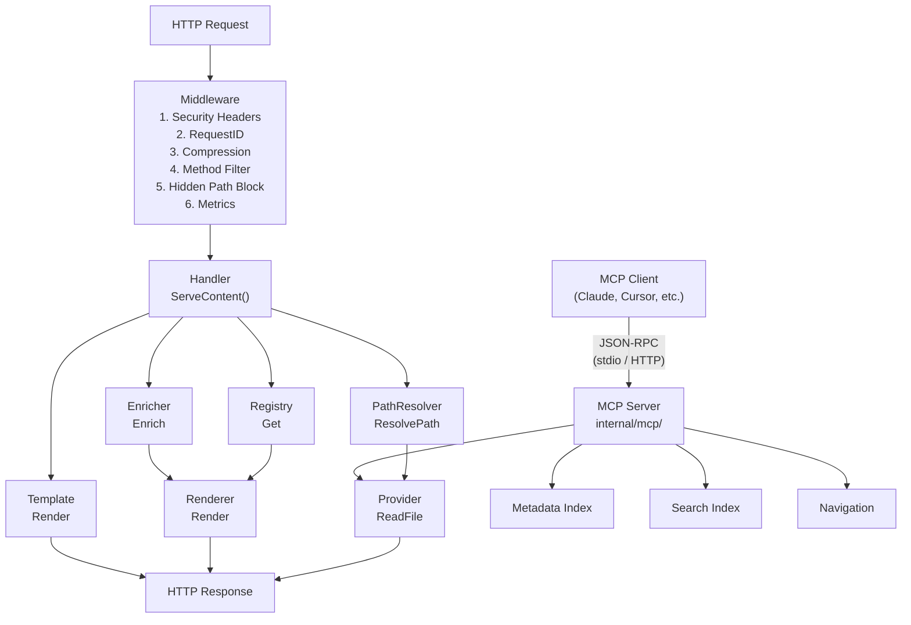
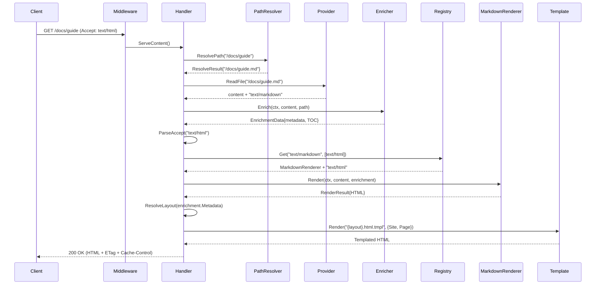
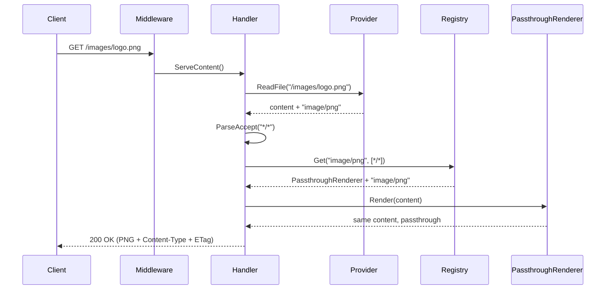

# Gomddoc Architecture

## Overview

Gomddoc is a production-ready HTTP server built with a clean, interface-driven architecture for serving documentation
with automatic content rendering. The system supports both local filesystem and remote Git repositories as content
sources. It is designed for extensibility, testability, and HTTP compliance.

## Architecture Diagram



## Core Components

### 1. Provider Layer

**Responsibility:** File I/O, MIME type detection, directory handling

```go
type Provider interface {
    ReadFile(ctx context.Context, path string) (content []byte, mimeType string, err error)
    Stat(ctx context.Context, path string) (fs.FileInfo, error)
    DefaultIndex() string
    RootFS(ctx context.Context) (fs.FS, error)
    io.Closer
}
```

**Implementations:**

- **FilesystemProvider** — Local filesystem via `os.DirFS()` with path traversal protection
- **GitProvider** — Remote Git repositories via go-git with configurable storage backend

Both providers share a common `normalizePath()` function for converting request paths to fs-compatible paths.

**URL Resolution:**

The `internal/resolve` package provides the `PathResolver` component that sits between HTTP handlers and the provider layer. It resolves incoming request URLs to actual file paths, handling:

- **Extensionless URLs**: Maps `/docs/guide` to `docs/guide.md` when `.md` is configured for stripping
- **Redirects**: Returns 301 redirects when a request includes a stripped extension (e.g., `/docs/guide.md` → `/docs/guide`)
- **Collision handling**: Resolves priority when multiple files match (first configured extension wins)
- **Build mode**: Generates directory-based URLs (`guide/index.html`) for static host compatibility
- **Exclusions**: Hidden and `exclude`-matched files get no mapping at all, so they are unreachable
  at their clean URL as well as their real path

```go
type PathResolver struct {
    toReal  map[string]string // extensionless -> real file path
    toClean map[string]string // real file path -> extensionless
}

type ResolveResult struct {
    FilePath     string
    RedirectTo   string
    IsRedirect   bool
}
```

The resolver is configured via `resolve.BuildOptions` with `strip_extensions` and `exclude` from
site config (default: `[".md"]` and `[]`). Request flow is Handler → PathResolver → Provider.

`PageURLPath(realPath, defaultIndex)` runs that mapping in the **reverse** direction — file path to
published URL — and is the single implementation of it. Serve mode never needs it (it is handed a
URL and resolves backwards to a file), but build mode walks files, and anything holding a real path
and rendering a link needs it: `buildFile`'s `Page.Path`, the `contentURL` template function
(see-also entries), the sitemap and feed generators, and `navigation.buildTree` — which is the
*producer* of the clean paths `Page.Path` is later matched against for prev/next and sidebar state.
Deriving it ad hoc is what let static builds advertise a `.md` canonical URL while the same build's
sitemap advertised the clean one. Default-index files fold to their directory (`guides/README.md` →
`/guides`, root → `/`); a nil receiver degrades to the real path, which is what a language walk with
no per-language pipeline gets. It describes the **serve** URL scheme: build's `prettyOutputPath`
independently decides where HTML is *written*, and the two are not yet reconciled for
`strip_extensions: []` or directories holding both `README.md` and `index.md`.

The `exclude` patterns are load-bearing here, not just an optimization: the `ContentExclusion`
middleware matches the *request* path, which no longer carries the extension, so a pattern like
`TODO.md` cannot match a request for `/TODO`. Every content index — `resolve.Build`,
`metadata.BuildIndex`, `navigation.NewGenerator`, `search.BuildIndex` — must therefore be given the
same patterns.

**Git Storage Backends:**
- **MemoryStorageFactory** (default) — In-memory clone for fast startup and small repos
- **DiskStorageFactory** — Filesystem-backed storage via `--git-storage-dir` for large repos that would OOM with in-memory storage. Uses URL-hashed subdirectories for isolation.

**Key Features:**
- stdlib `fs.FS` compatible paths (forward slashes, no leading `/`)
- Secure by default (DirIndex=false)
- Hidden file filtering in directory listings
- Directory requests try default index, then optionally generate listings
- Safe resource lifecycle: `RootFS()` returns `gitTreeFS` backed by shared `gitTreeState` — `Close()` invalidates all outstanding FS references via mutex-protected nil, preventing use-after-close and breaking the reference chain for GC
- **Git reads are serialised**: `gitTreeState` owns the cached tree behind an *exclusive* mutex, and it is the only synchronisation point for the git object graph. `GitProvider.ReadFile`/`Stat` and every `gitTreeFS` share it. This is a correctness requirement, not a choice — go-git memoises `object.Tree` lookups into unsynchronised maps and its storers mutate on read, so an `RWMutex` would let two "readers" hit a concurrent map write (an unrecoverable runtime throw). The only safe way to parallelise is N independent repo handles

### 2. Renderer Layer

**Responsibility:** Content transformation with MIME-type routing

```go
type ContentRenderer interface {
    InputMimeTypes() []string
    OutputMimeTypes() []string
    Render(ctx context.Context, content []byte, enrichment *enricher.EnrichmentData) (*RenderResult, error)
}

type RenderResult struct {
    Content  []byte
    MimeType string
}
```

Renderers declare both input and output MIME types, enabling two-dimensional content negotiation
(input type from the file + output type from the client's Accept header). Metadata and TOC are
provided by the enricher pipeline, not the renderer.

**Built-in Renderers:**

| Renderer | InputMimeTypes | OutputMimeTypes | Purpose |
| --- | --- | --- | --- |
| **MarkdownPassthroughRenderer** | `["text/markdown"]` | `["text/markdown"]` | Raw markdown with frontmatter stripped |
| **MarkdownRenderer** | `["text/markdown"]` | `["text/html"]` | Markdown → HTML with goldmark extensions |
| **PassthroughRenderer** | `["*/*"]` | `["*/*"]` | Catch-all, content unchanged |

Registration order matters: later registrations win ties. MarkdownPassthroughRenderer is registered
first, then MarkdownRenderer (so HTML is the default for `Accept: */*`), then PassthroughRenderer.

**Goldmark Extensions:**

Three custom goldmark extensions operate at the AST level during parsing and rendering:

1. **Heading Anchors** (`HeadingAnchorExtension`) — Custom `NodeRenderer` for `ast.KindHeading` that appends `<gmd-heading-anchor href="#id">` web component to headings with auto-generated IDs. Gated by `heading_anchors` feature toggle.
2. **Admonitions** (`AdmonitionExtension`) — AST transformer that detects `[!NOTE]`/`[!TIP]`/`[!IMPORTANT]`/`[!WARNING]`/`[!CAUTION]` patterns in blockquotes and replaces them with `AdmonitionNode` custom AST nodes, rendered as `<gmd-admonition type="..." title="...">` web component elements. Gated by `admonitions` feature toggle.
3. **Color Chips** (`ColorChipExtension`) — AST transformer that detects hex color codes in `ast.CodeSpan` nodes and replaces them with `ColorChipNode` custom AST nodes, rendered as `<gmd-color-chip>#HEX</gmd-color-chip>` web component elements. Gated by `color_chips` feature toggle.

Feature flags are passed to extensions via two channels: the parser context key (for AST transformers) and a document attribute (for node renderers). This enables per-page feature overrides via frontmatter. All extensions are always registered on the goldmark instance — disabled extensions simply skip transformation, leaving the original AST nodes to render with goldmark's defaults.

### 3. Registry

**Responsibility:** Two-dimensional renderer selection (input type + Accept header)

```go
type RendererRegistry interface {
    Register(renderer ContentRenderer)
    Get(inputMimeType string, accepted []negotiate.MediaType) (ContentRenderer, string, error)
    AvailableOutputTypes(inputMimeType string) []string
}
```

**Selection algorithm:**
1. Filter entries whose `InputMimeTypes()` match the input (exact=3 > type/*=2 > */*=1)
2. For each accepted type (sorted by q-value), score output types by specificity
3. Return best match; on tie, latest registered wins
4. Return `ErrNoMatchingRenderer` if no output match (→ 406 Not Acceptable)

Thread-safe with `sync.RWMutex`. Storage uses `[]registryEntry` (ordered list, not map).

### 4. Enricher Layer

**Responsibility:** Pre-rendering structured data extraction

```go
type Enricher interface {
    SupportedMimeTypes() []string
    Enrich(ctx context.Context, content []byte, path string) (*EnrichmentData, error)
}

type EnrichmentData struct {
    Metadata    map[string]any
    Features    map[string]bool // Page-level feature overrides from frontmatter
    TOC         *TOCNode
    Navigation  *NavTree
    RelatedDocs []RelatedDoc
    PrevPage    *PageLink       // Previous page in navigation order
    NextPage    *PageLink       // Next page in navigation order
}
```

The enricher runs before rendering to extract metadata, TOC, navigation, and related documents from
content. This decouples structured data extraction from output format — both HTML and markdown
renderers receive the same enrichment data.

**Built-in Enrichers:**

| Enricher | MIME Types | Extracts |
| --- | --- | --- |
| **MarkdownEnricher** | `text/markdown` | Frontmatter, TOC, navigation, related docs via metadata index |
| **NoOpEnricher** | _(fallback)_ | Empty `EnrichmentData{}` |

The `EnricherRegistry` is MIME-type-keyed and always returns an enricher (`Get()` never returns nil).
Uses `sync.RWMutex` for thread safety.

### 5. Handler Layer

**Responsibility:** HTTP orchestration and content negotiation

**Flow:**
1. Resolve request path to file path via PathResolver (handle extensionless URLs and redirects)
2. Read file + get MIME type (Provider)
3. Enrich content (extract metadata, TOC, related docs)
4. Parse Accept header → negotiate renderer via 2D registry lookup (input type + accepted output)
5. If no match → 406 Not Acceptable with available output types
6. Render content with enrichment data
7. Serve (wrapped in template if HTML, raw otherwise)

### 6. Template Layer

**Responsibility:** HTML template rendering with caching and breadcrumbs

```go
type Renderer interface {
    Render(ctx context.Context, name string, data any) ([]byte, error)
}
```

**Features:**
- Embedded themes via `embed.FS` with overlay filesystem for customization
- Production mode: `CachedTemplateStore` (sync.Map cache) with `singleflight` to coalesce concurrent cache-miss parses
- Dev mode: `PassthroughTemplateStore` (always re-parse)
- Buffer pool with 64KB cap to prevent memory bloat
- File handle validation at startup

**Template Functions:**

| Function | Signature | Purpose |
|----------|-----------|---------|
| `breadcrumbs` | `breadcrumbs(path) → []Breadcrumb` | Path-based breadcrumb navigation |
| `toc` | `toc(tocTree, [min, max]) → []*TOCNode` | Returns filtered TOC nodes for template rendering (default: h1-h2) |
| `navigation` | `navigation(navTree) → HTML` | Sidebar from enrichment `NavTree` |
| `editURL` | `editURL(pagePath) → string` | Combines `edit_url` config with page path |
| `.Feature` | `.Feature(name) → bool` | Checks if a named feature is enabled (pre-merged site + page overrides) |
| `inlineJSAsset` | `inlineJSAsset(name) → JS` | Loads asset as `template.JS` for `<script>` embedding |
| `inlineCSSAsset` | `inlineCSSAsset(name) → CSS` | Loads asset as `template.CSS` for `<style>` embedding |
| `inlineHTMLAsset` | `inlineHTMLAsset(name) → HTML` | Loads asset as `template.HTML` for HTML context (e.g. SVGs) |
| `contentURL` | `contentURL(filePath) → string` | Returns absolute URL path for a content file (extensionless when stripping is active) |
| `themeVarsCSS` | `themeVarsCSS() → CSS` | Generates `<style>` with `--theme-*` CSS custom properties from config |
| `assetURL` | `assetURL(name) → string` | Resolves static file to `/_assets/{name}` URL (validates existence) |

All functions are nil-safe — they return empty values when their backing generator is not configured.

### 7. Navigation Layer

**Responsibility:** Auto-generated sidebar navigation from content structure

```go
type NavNode struct {
    Label    string
    Path     string
    IsDir    bool
    IsActive bool
    IsOpen   bool
    Children []*NavNode
}
```

The navigation generator walks `Provider.RootFS()` to build a tree of all `.md` files, extracting titles from
`# heading` lines (skipping YAML frontmatter). All entries (directories and files) are sorted alphabetically and interleaved.
The default index file (e.g., `README.md`) is excluded from the tree. Empty directories are pruned.

Navigation data flows through the enricher pipeline: the `MarkdownEnricher` calls a `NavBuilder` function
(injected at startup to avoid import cycles) that builds the navigation tree. The tree is stored in
`EnrichmentData.Navigation` and passed to the template layer via `PageContext.Navigation`. The
`{{ navigation .Page.Navigation }}` template function renders it as nested `<details>/<summary>` elements
for collapsible directories with `<a>` links for files.

### 8. Metadata Index

**Responsibility:** Aggregate frontmatter metadata across all pages

```go
type Index struct {
    pages []PageInfo
    byTag map[string][]int
}
```

Built at startup by walking `RootFS()` and parsing YAML frontmatter concurrently with `errgroup`
(three-phase: collect paths → parse in parallel → merge sequentially). Uses a lightweight `---` delimiter
parser, no full goldmark render. Provides `AllPages()`, `AllTags()`, and `ByTag(tag)` lookups.

Exposed via JSON API:
- `GET /api/tags` — All tags (sorted)
- `GET /api/tags/{tag}` — Pages with the given tag

### 9. Search Index

**Responsibility:** Full-text search across all documentation pages

```go
type Index struct {
    docs          []document
    inverted      map[string][]posting
    docTermCounts []int // body token count per doc, for TF normalization
    docCount      int
}
```

Built at startup alongside the metadata index using the same 3-phase concurrent pattern. Tokenizes
markdown content (stripped of syntax) into a unified inverted index where each posting carries a field
tag (`fieldBody`, `fieldTitle`, `fieldDesc`). Title and description are tokenized through the same
pipeline as body content — no separate substring matching or lowered-string storage. Ranking uses
per-field TF-IDF: body uses standard TF*IDF, title gets a 3x IDF boost, and description gets a 1.5x
boost. IDF is precomputed once per query token. Queries use AND semantics — a document qualifies if
the token appears in any field. Snippet generation highlights matched terms with `<mark>` tags.

Exposed via JSON API:
- `GET /api/search?q=<query>&limit=<n>` — Full-text search with ranked results

**Search UI:** A shared `search.mjs` module (loaded via `inlineJSAsset`) provides a search modal across
all themes. Opens via Ctrl+K / Cmd+K or a header search button. Debounced fetch to `/api/search`,
keyboard navigation (arrow keys + Enter), and highlighted snippets. CSS uses theme custom properties
(`--color-bg`, `--color-text`, `--color-primary`, etc.) for automatic cross-theme compatibility.

### 10. MCP Server

**Responsibility:** AI-native documentation access via the Model Context Protocol

```go
type ServerDeps struct {
    Provider     provider.Provider
    MetaIndex    *metadata.Index
    SearchIndex  *search.Index
    ContentRoot  fs.FS
    DefaultIndex string
    SiteName     string
    Version      string
}

type MCPServer struct {
    server *mcp.Server
    deps   ServerDeps
}

func NewServer(deps ServerDeps) *MCPServer
func (s *MCPServer) Run(ctx context.Context) error       // stdio transport
func (s *MCPServer) HTTPHandler() http.Handler            // Streamable HTTP
```

The MCP server is a thin adapter that exposes gomddoc's existing internals — Provider, Metadata Index,
Search Index, and Navigation — via the MCP protocol. No new parsing or indexing logic is introduced.

Uses the official Go MCP SDK (`github.com/modelcontextprotocol/go-sdk`). Supports two transports:
stdio (for local clients like Claude Desktop/Cursor) and Streamable HTTP (for remote access via `/_mcp/`).

**Capabilities:**

| Category | Items |
|----------|-------|
| **Tools** (6) | `search_docs`, `read_page`, `list_pages`, `get_table_of_contents`, `read_section`, `find_related` |
| **Resources** (4) | `docs://site/index`, `docs://site/tags`, `docs://site/page/{+path}`, `docs://site/tag/{tag}` |
| **Prompts** (3) | `explain_concept`, `troubleshoot`, `summarize_page` |

All tools are annotated with `readOnlyHint: true` and `idempotentHint: true` for auto-approval trust.

**Section Extraction:** The `read_section` tool provides sub-page access by heading anchor ID — a line-based
algorithm extracts content between headings without requiring goldmark. Uses `slugifyHeading()` matching
goldmark's auto-heading-ID behavior.

### 11. Static Site Generator

**Responsibility:** Build static HTML from content for deployment to static hosts

The `gomddoc build` command reuses the same provider → renderer → template pipeline as `serve`. It walks
`contentRoot` via `fs.WalkDir`, renders `.md` files through the full pipeline (markdown → template → HTML),
copies non-markdown files as-is, and generates `index.html` alongside `README.html` for clean URLs.
File processing is parallelized with an `errgroup` worker pool bounded by `runtime.NumCPU()`.

### 12. Middleware Chain

Middleware is applied in two layers using `RouteGroup` for structured route registration:

**Shared middleware (applied to all routes via mux wrapper):**

1. **SecurityHeaders** — Sets X-Content-Type-Options, X-Frame-Options, Referrer-Policy, Permissions-Policy, HSTS
2. **RequestID** — Assigns unique request ID for tracing

**Auth group middleware (applied to authenticated routes via RouteGroup):**

3. **BasicAuth** — HTTP Basic Authentication via htpasswd file (when configured)

**Content-specific middleware (applied to content handler via Subgroup):**

4. **Compression** — Gzip with smart thresholds (min 1KB, skips images/video/audio/archives, SVG exception)
5. **MethodFilter** — Returns 405 Method Not Allowed for non-GET/HEAD requests with `Allow` header
6. **ContentExclusion** — Blocks hidden files (dot-prefixed, except `.well-known` per RFC 8615) and user-configured exclusion patterns. Uses `provider.IsHiddenPath()` — the same check applied by MCP tools to ensure consistent path restrictions across all entry points.
7. **ExtensionRedirect** — Redirects requests with stripped extensions (e.g., `/docs/guide.md` → `/docs/guide`) via 301.
8. **Metrics** — Prometheus counters and histograms (`http_requests_total`, `http_request_duration_seconds`)

**Route groups:**

| Group | Prefix | Middleware | Routes |
|-------|--------|-----------|--------|
| health | `/health` | _(none)_ | `/live`, `/ready` |
| _(mux direct)_ | | _(none)_ | `/robots.txt`, `/_assets/*` |
| auth | | BasicAuth (if configured) | `/metrics`, `/sitemap.xml`, `/_mcp/*` |
| auth → api | `/api` | _(inherits auth)_ | `/tags`, `/tags/{tag}`, `/search` |
| auth → mcp | `/_mcp` | _(inherits auth)_ | MCP Streamable HTTP endpoint |
| auth → debug | `/debug/pprof` | _(inherits auth)_ | `/`, `/cmdline`, `/profile`, `/symbol`, `/trace` |
| auth → content | | Compression, MethodFilter, ContentExclusion, ExtensionRedirect, Metrics | `/` (catch-all) |

### 13. Theme System

**Responsibility:** Visual presentation with 8 bundled themes and user customization

**Bundled Themes:**

| Theme | Style | Key Features |
|-------|-------|-------------|
| **default** | General purpose | Three-column layout (nav + content + TOC), Inter/JetBrains Mono |
| **academic** | Scholarly | Serif typography (Merriweather), justified text, warm parchment palette |
| **gitbook** | Documentation | Book-style reading (1.8 line height), tinted nav sidebar |
| **material** | Design system | Material Design 3, rounded corners, tonal elevation |
| **midnight** | Dark-first | Neon purple/cyan gradients, glowing code blocks and admonitions |
| **minimal** | Brutalist | System fonts only, zero border-radius, heavy typographic hierarchy |
| **nord** | Color palette | Nord 16-color palette, frosted glass aesthetic, glassmorphism |
| **ocean** | Colorful | Teal/navy gradients, sine-wave header clip-path |

**Common Features (all themes):**

All optional features are gated by the feature toggle system (`{{ .Feature "name" }}` template guards)
and can be disabled per-site or per-page:

- Light/dark mode toggle with `prefers-color-scheme` auto-detection (`dark_mode`)
- TOC scroll highlighting and sidebar (`toc`)
- Copy-to-clipboard code blocks (`code_copy`)
- Heading anchor links, revealed on hover (`heading_anchors`)
- Color chip hex swatches (`color_chips`)
- Search modal with Ctrl+K shortcut (`search`)
- KaTeX math rendering, client-side CDN (`katex`)
- Mermaid diagram support, client-side CDN, theme-aware (`mermaid`)
- Admonition styling (5 types)
- Touch device accessibility (`@media (hover: none)`)
- Responsive design (mobile/tablet/desktop)

**Theme Resolution Order:** Site `.gomddoc/assets/themes/<name>/` → Embedded `cmd/gomddoc/assets/themes/<name>/`
→ Fallback to `default` theme.

**Partial Override Resolution:** Three-layer resolution: default theme partials → active theme partials →
site-level partials (`.gomddoc/partials/`). Uses Go's `template.ParseFS` where last `{{ define }}` wins.
Site partials override specific theme partials without copying the whole theme.

**Shared head/script blocks:** `head-shared.html.tmpl` defines `head-meta` (canonical, feed, prev/next,
OpenGraph, Twitter Card, viewport, description, hreflang), `head-katex` and `scripts-shared`. Every theme,
bundled and external, calls these rather than re-implementing them — a theme that inlines its own copy
stops receiving anything added to the shared block, which is how the bundled `default` theme came to emit
no `hreflang` tags at all while all seven external themes did.

**Linking to content from a template:** templates that hold a *real file path* — tag listings, see-also
entries — must run it through the `contentURL` func rather than emitting it as an `href`. `contentURL`
applies `PageURLPath` **and** the renderer's language prefix (`template.WithLangPrefix`, set when
`setupLanguagePipelines` builds each language's renderer), so it is the only place the `/{lang}` rule for
content links lives. A per-language pipeline therefore needs its own renderer everywhere it is used —
`LangPipelineConfig.TemplateRenderer` on serve, `Pipeline.TemplateRenderer` in build. Passing the
default-language renderer resolves language paths against the wrong tree and falls back to a raw `.md`
link for any page that exists only in that language.

**Theme Variables:** CSS custom properties injected from `theme.vars` config map. Each key-value becomes
`--theme-{key}: {value}` in a `:root` block. Dark mode uses naming convention (`dark-bg`, `dark-text`).
Theme CSS references variables with fallbacks: `var(--theme-bg, #ffffff)`. Cached via `sync.Once`.

**Page Type Templates:** Frontmatter `layout` field selects alternative layouts from `<theme>/layouts/`.
`ResolveLayout()` appends `.html.tmpl` and checks `HasTemplate()`, falling back to `default.html.tmpl`.

**Static Asset Serving:** `/_assets/` route serves files from a 3-layer overlay FS built by `BuildStaticFS()`:
site `.gomddoc/static/` > theme `static/` > `assets/shared/static/`. FNV-64a ETags, immutable cache headers,
dotfile blocking. `gomddoc build` copies the overlay to `_assets/` in the output directory.

### 14. Web Components

**Responsibility:** Client-side rendering of interactive elements produced by goldmark extensions

**Location:** `cmd/gomddoc/assets/shared/gmd-*.mjs` (shared across all themes via `inlineJSAsset`)

**Components:**

1. **`<gmd-color-chip>`** — Shadow DOM. Renders inline hex color swatches with click-to-copy. Controlled by `color_chips` feature toggle.
2. **`<gmd-admonition>`** — Light DOM. Renders styled admonition blocks (note, tip, warning, etc.) from type/title attributes. Adds CSS classes and title element. Controlled by `admonitions` feature toggle.
3. **`<gmd-heading-anchor>`** — Shadow DOM. Renders heading anchor links (`#`) revealed on hover. Controlled by `heading_anchors` feature toggle.

**Convention:** All custom elements use the `gmd-` prefix. Themes override behavior by providing their own `.mjs` file in theme assets.

### 15. Internationalization and Localization

**Responsibility:** UI string translation (l10n) and multi-language content serving (i18n)

**Locale Bundle** (`internal/locale/`):

Three-layer YAML locale file loading: built-in (`cmd/gomddoc/assets/locales/`) → theme (`locales/`) → site (`.gomddoc/locales/`). Each file is named by BCP 47 code (e.g., `en-US.yml`, `fr-FR.yml`). The bundle provides `T(lang, key)` for string lookup with fallback chain: requested language → default language → raw key.

Templates call `{{ .T "key" }}` which delegates to the bound `tFunc`. JavaScript strings are passed via `data-` attributes on `<html>` (e.g., `data-search-placeholder`, `data-copy-label`).

**Multi-Language Content:**

Each non-default language lives under a BCP 47 directory at the content root (e.g., `fr-FR/`). The default language is served at `/`, others at `/{lang}/`. Each language gets its own pipeline instance:

| Component | Per-Language Instance |
|-----------|----------------------|
| `Provider` | `SubdirProvider` scoped to `{lang}/` subtree |
| `metadata.Index` | Independent frontmatter index |
| `search.Index` | Independent full-text index |
| Navigation | Independent nav tree |

**Language Detection:**

- **Serve mode**: URL prefix matching via `RouteGroup.Subgroup("/{lang}", ...)` with prefix stripping
- **Build mode**: File path prefix detection via `locale.ExtractLangFromPath()`
- **API endpoints**: `?lang=` query param > `Accept-Language` header > config default

**Multi-Language Routes** (added to route table):

| Group | Prefix | Middleware | Routes |
|-------|--------|-----------|--------|
| auth → lang content | `/{lang}` | Compression, MethodFilter, ContentExclusion, ExtensionRedirect, Metrics | `/{lang}/` (catch-all per language) |

Per-language `/{lang}/sitemap.xml` and `/{lang}/feed.xml` routes are also registered.

**Build Output:**

`gomddoc build` detects language directories at the content root and runs `walkAndBuildToDir` per language with an `outputPrefix` of `{lang}/`. Generates a `sitemap-index.xml` referencing per-language sitemaps when multiple languages are present.

**Theme Support:**

- `hreflang.html.tmpl` — Renders `<link rel="alternate" hreflang="...">` tags
- `lang-switcher.html.tmpl` — Language picker showing active language as text, others as links

## Data Flow

### Markdown File Request



### Non-HTML File Request



## Error Handling

### Error Classification

All provider and renderer errors are mapped to HTTP status codes via `classifyError()`:

| Error                          | HTTP Status | Code |
| ------------------------------ | ----------- | ---- |
| `provider.ErrDirListingDisabled` | Forbidden | 403  |
| `os.ErrNotExist`, `provider.ErrNotFound` | Not Found | 404 |
| `fs.ErrPermission`            | Forbidden   | 403  |
| `context.Canceled`            | Client Closed | 499 |
| `context.DeadlineExceeded`    | Gateway Timeout | 504 |
| `provider.ErrInvalidGitURL`   | Bad Request | 400  |
| `provider.ErrGitAuthFailed`   | Unauthorized | 401 |
| `provider.ErrGitConnectFailed` | Bad Gateway | 502 |
| `provider.ErrGitRefNotFound`  | Not Found   | 404  |
| `provider.ErrGitLFSNotSupported` | Not Implemented | 501 |
| `provider.ErrFileTooLarge`    | Request Entity Too Large | 413 |
| `renderer.ErrNoRenderer`      | Unsupported Media Type | 415 |
| `renderer.ErrNoMatchingRenderer` | Not Acceptable | 406 |
| _(default)_                   | Internal Server Error | 500 |

All errors use `errors.Is()` for classification, supporting wrapped errors via `fmt.Errorf("%w", err)`.

### Custom Error Type

```go
type PathError struct {
    Op   string  // "read", "stat", "clone", etc.
    Path string
    Err  error   // Underlying sentinel error
}
```

## MIME Type Handling

### Normalization

`NormalizeMimeType()` strips charset/parameters for routing, but the full MIME type is preserved for HTTP headers.

- `"text/html; charset=utf-8"` → `"text/html"` (for routing)
- Full type preserved in `Content-Type` header

### Registry Wildcard Matching

Input types are scored: exact match (3) > type wildcard (2) > catch-all (1).
Output types are resolved before matching: `*/*` resolves to the input MIME type.

## Security

- **Path traversal**: `os.DirFS()` jails file access
- **Hidden files**: Middleware blocks dot-prefixed paths (except `.well-known`)
- **Method filtering**: Only GET and HEAD allowed (405 for others)
- **Security headers**: nosniff, DENY framing, referrer policy, permissions policy, HSTS — applied to all routes
- **Authentication**: BasicAuth via RouteGroup on all sensitive endpoints (API, metrics, pprof, sitemap, content). Health and public assets are unauthenticated.
- **Git SSH**: Host key verification via known_hosts (fail closed, no TOFU)
- **Clone timeout**: Enforced via `context.WithTimeout` (default 60s)
- **File size limits**: Git provider enforces 50MB max (configurable)
- **Log injection**: `text.SafeString` sanitizes user input in log messages

## SEO

- **Canonical URLs**: `<link rel="canonical">` on every page via `canonicalURL` template function. Requires `meta.domain` config.
- **Open Graph**: `og:title`, `og:description`, `og:url`, `og:type`, `og:site_name` meta tags. `og:type` overridable via frontmatter `og_type`.
- **Twitter Cards**: `twitter:card` summary tags with title and description.
- **XML Sitemap**: `/sitemap.xml` served dynamically (serve) and generated as static file (build). Uses metadata index. `<lastmod>` dates from `fs.Stat()` file mtime.
- **robots.txt**: `/robots.txt` served dynamically (serve) and generated as static file (build). Blocks `/_assets/`, `/api/`, `/debug/`.
- **JSON-LD**: `<script type="application/ld+json">` with Schema.org `TechArticle` (every page), `BreadcrumbList` (deep pages), `WebSite` with `SearchAction` (index page). Generated by `internal/seo.GenerateJSONLD()`, exposed via `jsonLD` template function and overridable `jsonld` partial.
- **URL construction**: Shared `internal/seo.PageURL()` normalizes domain + path using `net/url`. Strips default index files.

## Configuration

### Loading Priority (highest wins)

1. CLI flags/arguments (positional `dir`, `-p`, `--git-key-file`, `--git-storage-dir`, `--pprof`)
2. Environment variables (`GOMDDOC_SERVER_*`, `GOMDDOC_SITE_*`)
3. Config file (`.gomddoc/config.yml`)
4. Defaults

### Config Structure

```go
type Config struct {
    Server ServerConfig `env:"SERVER"`
    Site   SiteConfig   `env:"SITE"`
}

type ServerConfig struct {
    Port      string     `env:"PORT"`        // ":8080"
    DevMode   bool       `env:"DEV_MODE"`    // false
    Dir       string     `env:"DIR"`         // "."
    Pprof     bool       `env:"PPROF"`       // false
    HTTP      HTTPConfig `env:"HTTP"`        // Timeout tuning
}

type SiteConfig struct {
    DefaultIndex string           `env:"DEFAULT_INDEX" yaml:"default_index"` // "README.md"
    DirIndex     bool             `env:"DIR_INDEX"     yaml:"dir_index"`     // false
    EditURL      string           `env:"EDIT_URL"      yaml:"edit_url"`      // ""
    Meta         MetaConfig       `env:"META"          yaml:"meta"`
    Theme        ThemeConfig      `env:"THEME"         yaml:"theme"`          // name + vars + features
    Highlighting HighlightConfig  `env:"HIGHLIGHTING"  yaml:"highlighting"`
    Search       SearchConfig     `env:"SEARCH"        yaml:"search"`         // index: true
}
```

Environment variables are applied via reflection-based walking of the struct tree with `env` tags.

## Testing

### Coverage (as of 2026-04-08)

Overall statement coverage: **87.1%**

*Note: `cmd/gomddoc` is at 70.5% because some paths test via external binary execution (integration tests
that don't count toward Go's coverage instrumentation). Internal packages average ~90%+ coverage.*

### Test Strategy

- **Unit tests**: Package-level isolation with interfaces for mocking
- **Table-driven tests**: All components use `[]struct{...}` test tables
- **Parallel tests**: `t.Parallel()` where possible
- **Integration tests**: End-to-end request flow with real Provider + Registry + Handler
- **Context cancellation**: Tested in renderers and template layer
- **Benchmarks**: Hot-path benchmarks with small/medium/large document sizes for
  `MarkdownRenderer.Render`, `MarkdownEnricher.Enrich`, `DefaultRegistry.Get`,
  `HTMLRenderer.Render`, and `compressionWriter`. Run via `make bench` (quick) or
  `make bench-compare` (regression detection with benchstat)

## Extensibility

### Adding Custom Renderers

See [Custom Renderers Guide](custom-renderers.md) for complete examples. In brief:

```go
type MyRenderer struct{}
func (r *MyRenderer) InputMimeTypes() []string  { return []string{"text/x-custom"} }
func (r *MyRenderer) OutputMimeTypes() []string { return []string{"text/html"} }
func (r *MyRenderer) Render(ctx context.Context, content []byte, enrichment *enricher.EnrichmentData) (*renderer.RenderResult, error) {
    // transform content, optionally use enrichment.Metadata/TOC...
    return &renderer.RenderResult{Content: output, MimeType: "text/html; charset=utf-8"}, nil
}

// Register in main.go:
registry.Register(&MyRenderer{})
```

### Adding Custom Providers

Implement the `Provider` interface. The `NewProvider()` factory auto-detects Git URLs vs filesystem paths.

## Design Decisions

| Decision | Rationale |
| -------- | --------- |
| MIME-type routing | Universal, stdlib-backed, natural fit with HTTP Accept negotiation |
| Separate Provider/Renderer | I/O vs transformation separation; mock either independently |
| PassthroughRenderer `*/*` | No maintenance when new file types added; guarantees all types handled |
| Context in Provider | Propagates cancellation/deadlines from HTTP handlers through provider calls |
| `RenderResult` struct | Minimal return (content + MIME type); metadata/TOC provided by enricher |
| Enricher before render | Decouples structured data extraction from output format; same enrichment for HTML and markdown |
| `path` not `filepath` for fs.FS | `io/fs` spec requires forward slashes; `filepath` breaks on Windows |
| Clone timeout via context | Standard Go pattern; `git.CloneContext()` respects cancellation |
| SSH fail-closed | Security: no TOFU fallback; require known_hosts for host key verification |
| StorageFactory abstraction | Swap memory/disk storage without changing GitProvider; default memory for small repos |
| Navigation via enricher | Navigation tree built by enricher (via NavBuilder injection), passed to template in PageContext |
| Lightweight frontmatter parser | 10-100x faster than full goldmark render for metadata-only extraction |
| Build reuses serve pipeline | Single source of truth for rendering; no divergence between serve and build output |
| Color chip as web component | Shadow DOM encapsulation prevents theme CSS conflicts; `::part()` allows per-theme styling |
| `inlineJSAsset` / `inlineCSSAsset` / `inlineHTMLAsset` | Themes share components without copy-paste; search order (theme → shared) allows overrides; typed returns match `html/template` context escaping |
| MCP as thin adapter | Reuses Provider, MetaIndex, SearchIndex, Navigation — no new parsing/indexing; MCP package is purely protocol translation |
| Official Go MCP SDK | Semver stable (v1.4.x), auto-generates JSON Schema from Go struct tags, struct-based options matching gomddoc conventions |
| `docs://` URI scheme | Semantic resource identification separate from HTTP URLs; clear namespace for MCP resource discovery |
| Section extraction without goldmark | Line-based heading parser keeps MCP package lightweight; no dependency on rendering pipeline |
| All tools `readOnlyHint` | Trust signal for MCP clients to enable auto-approval — gomddoc never modifies content |
| Generic feature toggles (`map[string]bool`) | Replaces per-feature booleans; default-to-true semantics; config + env + frontmatter override; pre-merged on `PageContext` |
| Client-side KaTeX/Mermaid | Zero server deps; CDN delivery; theme-aware dark/light rendering |
| TOC scroll highlighting | `IntersectionObserver`-free approach using `getBoundingClientRect` for broad compatibility |
| Touch `@media (hover: none)` | Mobile/tablet users can't hover — show interactive elements by default |
| 3-layer partial resolution | Site partials override theme partials override default — max customization without forking |
| Config-only theme vars | No README parsing; `--theme-*` CSS custom properties from config only — simple, predictable |
| Layout fallback to default | Missing layouts gracefully degrade to `default.html.tmpl` — no broken pages |
| Static overlay FS for assets | Reuses existing `OverlayFS`; same site > theme > shared precedence as templates |
| PathResolver between handler and provider | Clean separation of URL resolution from file I/O; enables extensionless URLs with 301 redirects for extension requests |
| Extension stripping via config list | Ordered list determines priority for collision handling; flexible for multiple renderable formats |
| Build mode directory URLs | `guide.md` → `guide/index.html` works on all static hosts without server rewrites; proper REST resource semantics |

## Glossary

- **Provider**: Reads files and detects MIME types (filesystem or Git)
- **PathResolver**: URL-to-file-path resolver that handles extensionless URLs, redirects, and collision detection
- **Enricher**: Pre-rendering step that extracts structured data (metadata, TOC, related docs) from content
- **Renderer**: Transforms content from one MIME type to another
- **Registry**: MIME type → renderer mapping with wildcard support
- **Handler**: HTTP request orchestrator
- **MIME Normalization**: Stripping charset parameters for routing decisions
- **Content Negotiation**: Matching server output to client Accept header
- **Passthrough**: Serving content unchanged with original MIME type
- **Template Wrapping**: Adding HTML layout around rendered content
- **TOC**: Table of Contents extracted from heading structure
- **Overlay FS**: Layered filesystem where user assets override embedded defaults
- **Navigation Tree**: Auto-generated sidebar from directory structure (`NavNode` tree)
- **Metadata Index**: Aggregated frontmatter data across all pages for tag-based discovery
- **Static Site Generation**: `gomddoc build` output for deployment to static hosts
- **Web Components**: `<gmd-*>` custom elements that render interactive content produced by goldmark extensions (color chips, admonitions, heading anchors). Shadow DOM or light DOM depending on the component.
- **Feature Toggle**: A named boolean flag (`map[string]bool`) controlling optional capabilities (dark mode, TOC, color chips, etc.). Site-level defaults merged with per-page frontmatter overrides. Default-to-true semantics.
- **Goldmark Extensions**: Custom goldmark `Extender` implementations (heading anchors, admonitions, color chips) that operate at the AST level during parsing and rendering, emitting `<gmd-*>` web component elements, gated by feature toggles
- **Theme**: A package with layouts, partials, and optional static assets that defines visual presentation
- **Theme Variables**: CSS custom properties (`--theme-*`) injected from site config for color/typography customization
- **Page Type**: Layout variant selected via frontmatter `layout` field (e.g., `page`, `api`, `changelog`)
- **`inlineJSAsset`** / **`inlineCSSAsset`** / **`inlineHTMLAsset`**: Template functions that load assets from theme directory with shared directory fallback, returning the correct `html/template` safe type for each context
- **`assetURL`**: Template function that resolves static files to `/_assets/` URLs
- **MCP Server**: Model Context Protocol adapter exposing Provider, MetaIndex, SearchIndex, and Navigation to AI models
- **MCP Tool**: A model-invocable action (search, read, list, navigate) exposed via the MCP protocol
- **MCP Resource**: A data source identified by a `docs://` URI, accessed by MCP clients
- **Section Extraction**: Line-based algorithm that extracts markdown content under a specific heading by anchor ID
