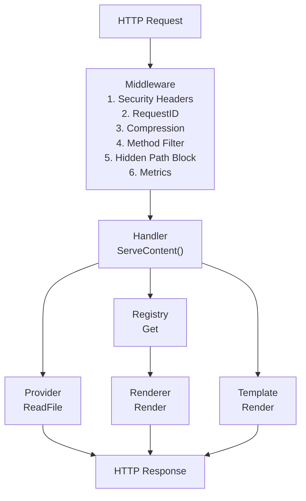
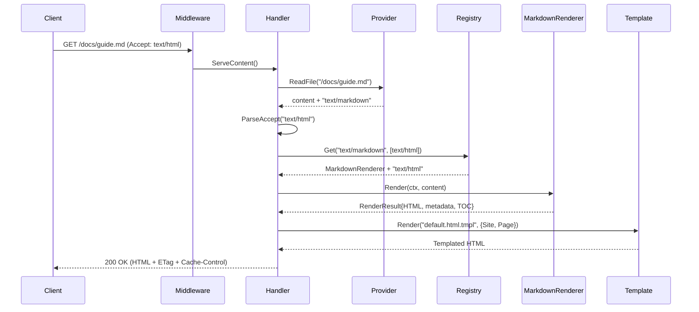
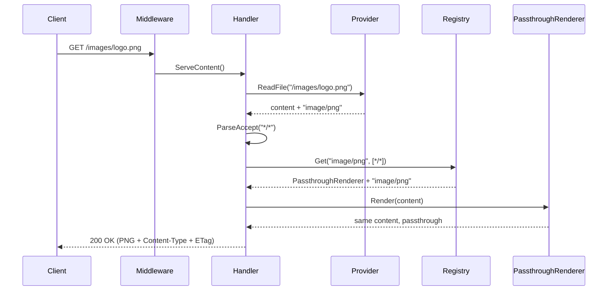

# Gomddoc Architecture

## Overview

Gomddoc is a production-ready HTTP server built with a clean, interface-driven architecture for serving documentation
with automatic content rendering. The system supports both local filesystem and remote Git repositories as content
sources. It is designed for extensibility, testability, and HTTP compliance.

## Architecture Diagram



## Core Components

### 1. Provider Layer

**Responsibility:** File I/O, MIME type detection, directory handling

```go
type Provider interface {
    ReadFile(ctx context.Context, path string) (content []byte, mimeType string, error)
    Stat(ctx context.Context, path string) (fs.FileInfo, error)
    DefaultIndex() string
    Close() error
}
```

**Implementations:**

- **FilesystemProvider** — Local filesystem via `os.DirFS()` with path traversal protection
- **GitProvider** — Remote Git repositories via go-git with configurable storage backend

Both providers share a common `normalizePath()` function for converting request paths to fs-compatible paths.

**Git Storage Backends:**
- **MemoryStorageFactory** (default) — In-memory clone for fast startup and small repos
- **DiskStorageFactory** — Filesystem-backed storage via `--git-storage-dir` for large repos that would OOM with in-memory storage. Uses URL-hashed subdirectories for isolation.

**Key Features:**
- stdlib `fs.FS` compatible paths (forward slashes, no leading `/`)
- Secure by default (DirIndex=false)
- Hidden file filtering in directory listings
- Directory requests try default index, then optionally generate listings

### 2. Renderer Layer

**Responsibility:** Content transformation with MIME-type routing

```go
type ContentRenderer interface {
    InputMimeTypes() []string
    OutputMimeTypes() []string
    Render(ctx context.Context, content []byte) (*RenderResult, error)
}

type RenderResult struct {
    Content  []byte
    MimeType string
    Metadata map[string]any
    TOC      *TOCNode
}
```

Renderers declare both input and output MIME types, enabling two-dimensional content negotiation
(input type from the file + output type from the client's Accept header).

**Built-in Renderers:**

| Renderer | InputMimeTypes | OutputMimeTypes | Purpose |
| --- | --- | --- | --- |
| **MarkdownPassthroughRenderer** | `["text/markdown"]` | `["text/markdown"]` | Raw markdown with metadata/TOC extracted |
| **MarkdownRenderer** | `["text/markdown"]` | `["text/html"]` | Markdown → HTML with post-processing |
| **PassthroughRenderer** | `["*/*"]` | `["*/*"]` | Catch-all, content unchanged |

Registration order matters: later registrations win ties. MarkdownPassthroughRenderer is registered
first, then MarkdownRenderer (so HTML is the default for `Accept: */*`), then PassthroughRenderer.

**Post-Processing Pipeline:**

After goldmark renders the Markdown to HTML, three post-processors run in sequence:

1. **Heading Anchors** (`addHeadingAnchors()`) — Inserts `<a href="#id" class="heading-anchor" aria-hidden="true">#</a>` into headings with auto-generated IDs. Revealed on hover via CSS.
2. **Admonitions** (`TransformAdmonitions()`) — Converts GitHub-style `[!NOTE]`/`[!TIP]`/`[!IMPORTANT]`/`[!WARNING]`/`[!CAUTION]` blockquotes into `<div class="admonition admonition-{type}">` elements with styled titles.
3. **Color Chips** (`transformColorChips()`) — Replaces inline `<code>#HEX</code>` with `<color-chip>#HEX</color-chip>` web component elements. Controlled by global config (`color_chips`) and per-page frontmatter override.

Each stage operates on the HTML string output of the previous stage. The pipeline is deterministic and
order-dependent (heading anchors must run before admonitions to avoid processing anchor elements as content).

### 3. Registry

**Responsibility:** Two-dimensional renderer selection (input type + Accept header)

```go
type RendererRegistry interface {
    Register(renderer ContentRenderer)
    Get(inputMimeType string, accepted []negotiate.MediaType) (ContentRenderer, string, error)
    AvailableOutputTypes(inputMimeType string) []string
}
```

**Selection algorithm:**
1. Filter entries whose `InputMimeTypes()` match the input (exact=3 > type/*=2 > */*=1)
2. For each accepted type (sorted by q-value), score output types by specificity
3. Return best match; on tie, latest registered wins
4. Return `ErrNoMatchingRenderer` if no output match (→ 406 Not Acceptable)

Thread-safe with `sync.RWMutex`. Storage uses `[]registryEntry` (ordered list, not map).

### 4. Handler Layer

**Responsibility:** HTTP orchestration and content negotiation

**Flow:**
1. Read file + get MIME type (Provider)
2. Parse Accept header → negotiate renderer via 2D registry lookup (input type + accepted output)
3. If no match → 406 Not Acceptable with available output types
4. Render content (produces output content + metadata + TOC)
5. Serve (wrapped in template if HTML, raw otherwise)

### 5. Template Layer

**Responsibility:** HTML template rendering with caching and breadcrumbs

```go
type Renderer interface {
    Render(ctx context.Context, name string, data any) ([]byte, error)
}
```

**Features:**
- Embedded themes via `embed.FS` with overlay filesystem for customization
- Production mode: `CachedTemplateStore` (sync.Map cache)
- Dev mode: `PassthroughTemplateStore` (always re-parse)
- Buffer pool with 64KB cap to prevent memory bloat
- File handle validation at startup

**Template Functions:**

| Function | Signature | Purpose |
|----------|-----------|---------|
| `breadcrumbs` | `breadcrumbs(path) → []Breadcrumb` | Path-based breadcrumb navigation |
| `toc` | `toc(tocTree, [min, max]) → HTML` | Nested `<ul>` table of contents (default: h1-h2) |
| `navigation` | `navigation(currentPath) → HTML` | Auto-generated sidebar from directory structure |
| `editURL` | `editURL(pagePath) → string` | Combines `edit_url` config with page path |
| `inlineAsset` | `inlineAsset(name) → JS` | Loads asset from theme dir → shared dir fallback |

All functions are nil-safe — they return empty values when their backing generator is not configured.

### 6. Navigation Layer

**Responsibility:** Auto-generated sidebar navigation from content structure

```go
type NavNode struct {
    Label    string
    Path     string
    IsDir    bool
    IsActive bool
    IsOpen   bool
    Children []*NavNode
}
```

The navigation generator walks `Provider.RootFS()` to build a tree of all `.md` files, extracting titles from
`# heading` lines (skipping YAML frontmatter). Directories are sorted first, then files alphabetically.
The default index file (e.g., `README.md`) is excluded from the tree. Empty directories are pruned.

Rendered via the `{{ navigation .Page.Path }}` template function as nested `<details>/<summary>` elements
for collapsible directories with `<a>` links for files.

### 7. Metadata Index

**Responsibility:** Aggregate frontmatter metadata across all pages

```go
type Index struct {
    pages []PageInfo
    byTag map[string][]int
}
```

Built at startup by walking `RootFS()` and parsing YAML frontmatter concurrently with `errgroup`
(three-phase: collect paths → parse in parallel → merge sequentially). Uses a lightweight `---` delimiter
parser, no full goldmark render. Provides `AllPages()`, `AllTags()`, and `ByTag(tag)` lookups.

Exposed via JSON API:
- `GET /api/tags` — All tags (sorted)
- `GET /api/tags/{tag}` — Pages with the given tag

### 8. Static Site Generator

**Responsibility:** Build static HTML from content for deployment to static hosts

The `gomddoc build` command reuses the same provider → renderer → template pipeline as `serve`. It walks
`contentRoot` via `fs.WalkDir`, renders `.md` files through the full pipeline (markdown → template → HTML),
copies non-markdown files as-is, and generates `index.html` alongside `README.html` for clean URLs.
File processing is parallelized with an `errgroup` worker pool bounded by `runtime.NumCPU()`.

### 9. Middleware Chain

**Order (outermost to innermost):**

1. **SecurityHeaders** — Sets X-Content-Type-Options, X-Frame-Options, Referrer-Policy, Permissions-Policy, HSTS
2. **RequestID** — Assigns unique request ID for tracing
3. **Compression** — Gzip with smart thresholds (min 1KB, skips images/video/audio/archives, SVG exception)
4. **MethodFilter** — Returns 405 Method Not Allowed for non-GET/HEAD requests with `Allow` header
5. **BlockHiddenPaths** — Returns 404 for dot-prefixed path segments (except `.well-known` per RFC 8615)
6. **Metrics** — Prometheus counters and histograms (`http_requests_total`, `http_request_duration_seconds`)

### 10. Theme System

**Responsibility:** Visual presentation with 8 bundled themes and user customization

**Bundled Themes:**

| Theme | Style | Key Features |
|-------|-------|-------------|
| **default** | General purpose | Three-column layout (nav + content + TOC), Inter/JetBrains Mono |
| **academic** | Scholarly | Serif typography (Merriweather), justified text, warm parchment palette |
| **gitbook** | Documentation | Book-style reading (1.8 line height), tinted nav sidebar |
| **material** | Design system | Material Design 3, rounded corners, tonal elevation |
| **midnight** | Dark-first | Neon purple/cyan gradients, glowing code blocks and admonitions |
| **minimal** | Brutalist | System fonts only, zero border-radius, heavy typographic hierarchy |
| **nord** | Color palette | Nord 16-color palette, frosted glass aesthetic, glassmorphism |
| **ocean** | Colorful | Teal/navy gradients, sine-wave header clip-path |

**Common Features (all themes):**
- Light/dark mode toggle with `prefers-color-scheme` auto-detection
- TOC scroll highlighting (active heading tracking)
- Copy-to-clipboard code blocks
- Heading anchor links (revealed on hover)
- Admonition styling (5 types)
- Touch device accessibility (`@media (hover: none)`)
- Responsive design (mobile/tablet/desktop)
- KaTeX math rendering (client-side CDN)
- Mermaid diagram support (client-side CDN, theme-aware)

**Theme Resolution Order:** Site `.gomddoc/assets/themes/<name>/` → Embedded `cmd/gomddoc/assets/themes/<name>/`
→ Fallback to `default` theme.

### 11. Color Chip Web Component

**Responsibility:** Render inline hex color codes as interactive color swatches

**Location:** `cmd/gomddoc/assets/shared/color-chip.mjs` (shared across all themes via `inlineAsset`)

**Features:**
- Shadow DOM encapsulation — no style leakage between themes
- Inline swatch rendering from 3-digit or 6-digit hex codes
- Click-to-copy with "Copied!" feedback (1.5s timeout)
- Accessible: `role="img"`, `aria-label`, exposed `::part(swatch)` and `::part(label)` for styling
- Inherits theme colors via CSS custom properties
- Controlled by `color_chips` config (global) and `color_chips` frontmatter (per-page)

**Pipeline integration:** The `transformColorChips()` post-processor converts `<code>#HEX</code>` to
`<color-chip>#HEX</color-chip>`. Themes load the component via `{{ inlineAsset "color-chip.mjs" }}`.

## Data Flow

### Markdown File Request



### Non-HTML File Request



## Error Handling

### Error Classification

All provider and renderer errors are mapped to HTTP status codes via `classifyError()`:

| Error                          | HTTP Status | Code |
| ------------------------------ | ----------- | ---- |
| `provider.ErrDirListingDisabled` | Forbidden | 403  |
| `os.ErrNotExist`, `provider.ErrNotFound` | Not Found | 404 |
| `fs.ErrPermission`            | Forbidden   | 403  |
| `context.Canceled`            | Client Closed | 499 |
| `context.DeadlineExceeded`    | Gateway Timeout | 504 |
| `provider.ErrInvalidGitURL`   | Bad Request | 400  |
| `provider.ErrGitAuthFailed`   | Unauthorized | 401 |
| `provider.ErrGitConnectFailed` | Bad Gateway | 502 |
| `provider.ErrGitRefNotFound`  | Not Found   | 404  |
| `provider.ErrGitLFSNotSupported` | Not Implemented | 501 |
| `provider.ErrFileTooLarge`    | Request Entity Too Large | 413 |
| `renderer.ErrNoRenderer`      | Unsupported Media Type | 415 |
| `renderer.ErrNoMatchingRenderer` | Not Acceptable | 406 |
| _(default)_                   | Internal Server Error | 500 |

All errors use `errors.Is()` for classification, supporting wrapped errors via `fmt.Errorf("%w", err)`.

### Custom Error Type

```go
type PathError struct {
    Op   string  // "read", "stat", "clone", etc.
    Path string
    Err  error   // Underlying sentinel error
}
```

## MIME Type Handling

### Normalization

`NormalizeMimeType()` strips charset/parameters for routing, but the full MIME type is preserved for HTTP headers.

- `"text/html; charset=utf-8"` → `"text/html"` (for routing)
- Full type preserved in `Content-Type` header

### Registry Wildcard Matching

Input types are scored: exact match (3) > type wildcard (2) > catch-all (1).
Output types are resolved before matching: `*/*` resolves to the input MIME type.

## Security

- **Path traversal**: `os.DirFS()` jails file access
- **Hidden files**: Middleware blocks dot-prefixed paths (except `.well-known`)
- **Method filtering**: Only GET and HEAD allowed (405 for others)
- **Security headers**: nosniff, DENY framing, referrer policy, permissions policy, HSTS
- **Git SSH**: Host key verification via known_hosts (fail closed, no TOFU)
- **Clone timeout**: Enforced via `context.WithTimeout` (default 60s)
- **File size limits**: Git provider enforces 50MB max (configurable)
- **Log injection**: `text.SafeString` sanitizes user input in log messages

## Configuration

### Loading Priority (highest wins)

1. CLI flags (`-d`, `-p`, `-dev`, `--git-key-file`, `--git-storage-dir`)
2. Environment variables (`GOMDDOC_SERVER_*`, `GOMDDOC_SITE_*`)
3. Config file (`.gomddoc/config.yml`)
4. Defaults

### Config Structure

```go
type Config struct {
    Server ServerConfig `env:"SERVER"`
    Site   SiteConfig   `env:"SITE"`
}

type ServerConfig struct {
    Port      string     `env:"PORT"`        // ":8080"
    DevMode   bool       `env:"DEV_MODE"`    // false
    Dir       string     `env:"DIR"`         // "."
    GitSSHKey string     `env:"GIT_SSH_KEY"` // ""
    HTTP      HTTPConfig `env:"HTTP"`        // Timeout tuning
}

type SiteConfig struct {
    DefaultIndex string           `env:"DEFAULT_INDEX" yaml:"default_index"` // "README.md"
    DirIndex     bool             `env:"DIR_INDEX"     yaml:"dir_index"`     // false
    EditURL      string           `env:"EDIT_URL"      yaml:"edit_url"`      // ""
    ColorChips   bool             `env:"COLOR_CHIPS"   yaml:"color_chips"`   // true
    Meta         MetaConfig       `env:"META"          yaml:"meta"`
    Theme        ThemeConfig      `env:"THEME"         yaml:"theme"`
    Highlighting HighlightConfig  `env:"HIGHLIGHTING"  yaml:"highlighting"`
}
```

Environment variables are applied via reflection-based walking of the struct tree with `env` tags.

## Testing

### Coverage (as of 2026-03-23)

Overall statement coverage: **80.6%**

*Note: Overall coverage includes `cmd/gomddoc` which tests via external binary execution (integration tests
that don't count toward Go's coverage instrumentation). Internal packages average ~90%+ coverage.*

### Test Strategy

- **Unit tests**: Package-level isolation with interfaces for mocking
- **Table-driven tests**: All components use `[]struct{...}` test tables
- **Parallel tests**: `t.Parallel()` where possible
- **Integration tests**: End-to-end request flow with real Provider + Registry + Handler
- **Context cancellation**: Tested in renderers and template layer

## Extensibility

### Adding Custom Renderers

See [Custom Renderers Guide](custom-renderers.md) for complete examples. In brief:

```go
type MyRenderer struct{}
func (r *MyRenderer) InputMimeTypes() []string  { return []string{"text/x-custom"} }
func (r *MyRenderer) OutputMimeTypes() []string { return []string{"text/html"} }
func (r *MyRenderer) Render(ctx context.Context, content []byte) (*renderer.RenderResult, error) {
    // transform content...
    return &renderer.RenderResult{Content: output, MimeType: "text/html; charset=utf-8"}, nil
}

// Register in main.go:
registry.Register(&MyRenderer{})
```

### Adding Custom Providers

Implement the `Provider` interface. The `NewProvider()` factory auto-detects Git URLs vs filesystem paths.

## Design Decisions

| Decision | Rationale |
| -------- | --------- |
| MIME-type routing | Universal, stdlib-backed, natural fit with HTTP Accept negotiation |
| Separate Provider/Renderer | I/O vs transformation separation; mock either independently |
| PassthroughRenderer `*/*` | No maintenance when new file types added; guarantees all types handled |
| Context in Provider | Propagates cancellation/deadlines from HTTP handlers through provider calls |
| `RenderResult` struct | Extensible return (content + metadata + TOC) without interface churn |
| `path` not `filepath` for fs.FS | `io/fs` spec requires forward slashes; `filepath` breaks on Windows |
| Clone timeout via context | Standard Go pattern; `git.CloneContext()` respects cancellation |
| SSH fail-closed | Security: no TOFU fallback; require known_hosts for host key verification |
| StorageFactory abstraction | Swap memory/disk storage without changing GitProvider; default memory for small repos |
| Navigation via template func | Same pattern as breadcrumbs; no handler changes; `{{ navigation .Page.Path }}` |
| Lightweight frontmatter parser | 10-100x faster than full goldmark render for metadata-only extraction |
| Build reuses serve pipeline | Single source of truth for rendering; no divergence between serve and build output |
| Color chip as web component | Shadow DOM encapsulation prevents theme CSS conflicts; `::part()` allows per-theme styling |
| `inlineAsset` template func | Themes share components without copy-paste; search order (theme → shared) allows overrides |
| Client-side KaTeX/Mermaid | Zero server deps; CDN delivery; theme-aware dark/light rendering |
| TOC scroll highlighting | `IntersectionObserver`-free approach using `getBoundingClientRect` for broad compatibility |
| Touch `@media (hover: none)` | Mobile/tablet users can't hover — show interactive elements by default |

## Glossary

- **Provider**: Reads files and detects MIME types (filesystem or Git)
- **Renderer**: Transforms content from one MIME type to another
- **Registry**: MIME type → renderer mapping with wildcard support
- **Handler**: HTTP request orchestrator
- **MIME Normalization**: Stripping charset parameters for routing decisions
- **Content Negotiation**: Matching server output to client Accept header
- **Passthrough**: Serving content unchanged with original MIME type
- **Template Wrapping**: Adding HTML layout around rendered content
- **TOC**: Table of Contents extracted from heading structure
- **Overlay FS**: Layered filesystem where user assets override embedded defaults
- **Navigation Tree**: Auto-generated sidebar from directory structure (`NavNode` tree)
- **Metadata Index**: Aggregated frontmatter data across all pages for tag-based discovery
- **Static Site Generation**: `gomddoc build` output for deployment to static hosts
- **Color Chip**: `<color-chip>` web component that renders hex color codes as interactive swatches
- **Post-Processing Pipeline**: Sequential HTML transformations after goldmark rendering (anchors → admonitions → color chips)
- **Theme**: A `default.html.tmpl` file with CSS/JS that defines the visual presentation of rendered content
- **`inlineAsset`**: Template function that loads JS/CSS from theme directory with shared directory fallback
