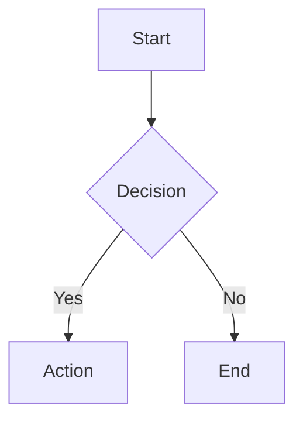

# Markdown Extensions

gomddoc supports several Markdown extensions beyond standard CommonMark, powered by goldmark and client-side rendering libraries.

## GitHub Flavored Markdown (GFM)

All GFM extensions are enabled by default:

- **Tables**: Pipe-delimited table syntax
- **Strikethrough**: `~~deleted text~~`
- **Task lists**: `- [x] completed` / `- [ ] pending`
- **Autolinks**: URLs are automatically linked

## YAML Front Matter

Documents can include YAML metadata at the top:

```markdown
---
title: My Document
author: Jane Doe
tags: [go, markdown]
---

# Content starts here
```

Front matter fields like `title` are used by the template system for page titles and metadata.

## Admonitions (Callout Blocks)

Admonitions are styled callout blocks that highlight important information. They use the same syntax as [GitHub's alerts](https://docs.github.com/en/get-started/writing-on-github/getting-started-with-writing-and-formatting-on-github/basic-writing-and-formatting-syntax#alerts).

### Syntax

Write a blockquote that starts with a type marker on the first line:

```markdown
> [!NOTE]
> This is a note with useful information.

> [!TIP]
> This is a helpful tip for the reader.

> [!IMPORTANT]
> This is important information that should not be missed.

> [!WARNING]
> This is a warning about potential issues.

> [!CAUTION]
> This is a caution about dangerous operations.
```

### Supported Types

| Type        | Purpose                                      | Color  |
|-------------|----------------------------------------------|--------|
| `NOTE`      | Useful information the reader should know     | Blue   |
| `TIP`       | Helpful advice for better results             | Green  |
| `IMPORTANT` | Key information that should not be overlooked | Purple |
| `WARNING`   | Potential issues or things to be aware of     | Orange |
| `CAUTION`   | Dangerous operations or critical warnings     | Red    |

### Multi-Line Content

Admonitions can contain multiple lines and paragraphs:

```markdown
> [!WARNING]
> This is the first paragraph of the warning.
>
> This is a second paragraph with more details.
```

The type markers are case-insensitive: `[!NOTE]`, `[!note]`, and `[!Note]` all produce the same result. Regular blockquotes (those without a type marker) are not affected.

## Math Rendering (KaTeX)

gomddoc supports mathematical notation using KaTeX, rendered client-side in the browser. Both inline and display (block) math are supported.

### Inline Math

Use single dollar signs to wrap inline math expressions:

```markdown
The quadratic formula is $x = \frac{-b \pm \sqrt{b^2 - 4ac}}{2a}$ which solves any quadratic equation.
```

### Display Math

Use double dollar signs for display (block) math equations:

```markdown
$$
\int_{-\infty}^{\infty} e^{-x^2} dx = \sqrt{\pi}
$$
```

### Supported Features

KaTeX supports a large subset of LaTeX math commands including:

- Greek letters: `$\alpha$`, `$\beta$`, `$\gamma$`
- Fractions: `$\frac{a}{b}$`
- Subscripts and superscripts: `$x_i^2$`
- Matrices and arrays
- Summations and integrals: `$\sum_{i=1}^{n} i$`
- Common operators and symbols

For a complete list of supported functions, see the [KaTeX documentation](https://katex.org/docs/supported.html).

### How It Works

Math rendering uses the KaTeX auto-render extension loaded from the jsDelivr CDN. When a page loads, the script scans the page content for `$...$` (inline) and `$$...$$` (display) delimiters and renders them as formatted math. No server-side processing or additional dependencies are required.

### Escaping Dollar Signs

If you need to display a literal dollar sign without triggering math rendering, use a backslash: `\$`. For example, `\$100` renders as a plain dollar amount.

## Mermaid Diagrams

gomddoc supports Mermaid diagrams using fenced code blocks with the `mermaid` language identifier:

````markdown

````

Mermaid diagrams are rendered client-side using the Mermaid JavaScript library loaded from the jsDelivr CDN. Supported diagram types include flowcharts, sequence diagrams, Gantt charts, class diagrams, and more. See the [Mermaid documentation](https://mermaid.js.org/) for details.

## Table of Contents

gomddoc automatically generates a table of contents from headings (h1-h3) in Markdown documents. The TOC appears as a sidebar on desktop and a toggleable panel on mobile. Heading IDs are auto-generated for anchor linking.
