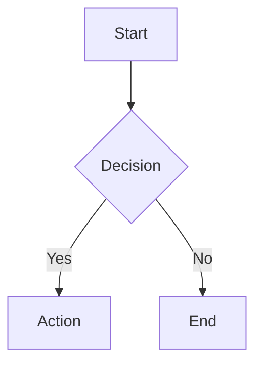

# Markdown Extensions

gomddoc supports several Markdown extensions beyond standard CommonMark, powered by goldmark and client-side rendering
libraries.

Several of them are theme features that can be turned off site-wide under `theme.features` in `.gomddoc/config.yml`,
or per page with the `features` frontmatter field. The default theme reads these toggles, all enabled unless set to
`false`: `admonitions`, `code_copy`, `color_chips`, `dark_mode`, `heading_anchors`, `katex`, `mermaid`, `search`,
`see_also`, `tag_chips` and `toc`. `gomddoc info` lists the toggles the active theme reads.

## GitHub Flavored Markdown (GFM)

All GFM extensions are enabled by default:

- **Tables**: Pipe-delimited table syntax
- **Strikethrough**: `~~deleted text~~`
- **Task lists**: `- [x] completed` / `- [ ] pending`
- **Autolinks**: URLs are automatically linked

Raw HTML in Markdown is passed through to the page unchanged.

## Syntax Highlighting

Fenced code blocks with a language (```` ```go ````) are highlighted on the server by
[Chroma](https://github.com/alecthomas/chroma), with the colors written inline. The style is set by
`highlighting.theme` (default `github`; any Chroma style name, such as `monokai` or `dracula`):

```yaml
highlighting:
  theme: monokai
```

With the `code_copy` feature on, each code block gets a copy button.

## YAML Front Matter

Documents can include YAML metadata at the top:

```markdown
---
title: My Document
description: A brief summary of this page
author: Jane Doe
tags: [go, markdown]
date: 2026-03-25
og_type: article
robots: "index, follow"
lang: en-US
layout: default
redirect_from:
  - /old/my-document
features:
  color_chips: true
---

# Content starts here
```

### Standard Fields

gomddoc processes these frontmatter fields with special behavior:

| Field | Type | Description |
|-------|------|-------------|
| `title` | string | Page title — used in `<title>`, Open Graph tags, search results, the navigation label, and the tags API |
| `description` | string | Page description — used in `<meta name="description">`, Open Graph, and search results |
| `tags` | array | Page tags — lowercased and trimmed; drive tag pages, `/api/tags`, related pages (See also), and `tag:` search. A tag containing `/` or `\` is dropped |
| `date` | date | Publication date (`YYYY-MM-DD` or an RFC 3339 timestamp) — JSON-LD `datePublished`, the tags API, and the fallback date for the sitemap, feed and JSON-LD `dateModified` |
| `author` | string | Author name — emitted as the `author` of the page's JSON-LD structured data |
| `og_type` | string | Open Graph type (defaults to `article`) — controls `<meta property="og:type">` |
| `robots` | string | Controls `<meta name="robots">` for this page (e.g., `noindex`). Pages with `noindex` are excluded from sitemap and feed |
| `lang` | string | BCP 47 language code — overrides the site-level `language` for this page's `<html lang>` attribute |
| `layout` | string | Alternate template layout file (e.g., `layout: wide` uses `wide.html.tmpl` instead of `default.html.tmpl`); falls back to `default.html.tmpl` when the theme has no such layout |
| `redirect_from` | array | List of URL paths that 301-redirect to this page (e.g., `[/old/path, /legacy]`); `build` writes a meta-refresh page for each |
| `features` | map | Per-page feature toggle overrides (e.g., `features: { color_chips: false }`), merged over `theme.features` |

`gomddoc doctor` reports a field of the wrong type (`content.frontmatter-type`), such as `tags: foo` instead of a
list, and a `features` key the active theme does not read.

### Custom Fields

Every frontmatter field is available in templates through `.Page.Meta`, e.g. `{{ index .Page.Meta "field_name" }}`.
In the tags API response, every field except `title`, `description`, `tags` and `date` (which have their own keys)
appears under the `meta` object, standard ones such as `author` included.

```yaml
---
title: API Reference
author: Jane Doe
category: reference
custom_field: custom_value
---
```

Access in templates:

```html
{{ if index .Page.Meta "author" }}
  <span>By {{ index .Page.Meta "author" }}</span>
{{ end }}
```

## Admonitions (Callout Blocks)

Admonitions are styled callout blocks that highlight important information. They use the same syntax as [GitHub's
alerts](https://docs.github.com/en/get-started/writing-on-github/getting-started-with-writing-and-formatting-on-github/basic-writing-and-formatting-syntax#alerts).

### Syntax

Write a blockquote that starts with a type marker on the first line:

```markdown
> [!NOTE]
> This is a note with useful information.

> [!TIP]
> This is a helpful tip for the reader.

> [!IMPORTANT]
> This is important information that should not be missed.

> [!WARNING]
> This is a warning about potential issues.

> [!CAUTION]
> This is a caution about dangerous operations.
```

### Supported Types

| Type        | Purpose                                      | Color  |
|-------------|----------------------------------------------|--------|
| `NOTE`      | Useful information the reader should know     | Blue   |
| `TIP`       | Helpful advice for better results             | Green  |
| `IMPORTANT` | Key information that should not be overlooked | Purple |
| `WARNING`   | Potential issues or things to be aware of     | Orange |
| `CAUTION`   | Dangerous operations or critical warnings     | Red    |

### Multi-Line Content

Admonitions can contain multiple lines and paragraphs:

```markdown
> [!WARNING]
> This is the first paragraph of the warning.
>
> This is a second paragraph with more details.
```

The type markers are case-insensitive: `[!NOTE]`, `[!note]`, and `[!Note]` all produce the same result. Regular
blockquotes (those without a type marker) are not affected.

Admonitions render as a `<gmd-admonition>` web component. With the `admonitions` feature off, the block renders as an
ordinary blockquote with the marker as text.

## Math Rendering (KaTeX)

gomddoc supports mathematical notation using KaTeX, rendered client-side in the browser when the `katex` feature is on.
Both inline and display (block) math are supported.

### Inline Math

Use single dollar signs to wrap inline math expressions:

```markdown
The quadratic formula is $x = \frac{-b \pm \sqrt{b^2 - 4ac}}{2a}$ which solves any quadratic equation.
```

### Display Math

Use double dollar signs for display (block) math equations:

```markdown
$$
\int_{-\infty}^{\infty} e^{-x^2} dx = \sqrt{\pi}
$$
```

### Supported Features

KaTeX supports a large subset of LaTeX math commands including:

- Greek letters: `$\alpha$`, `$\beta$`, `$\gamma$`
- Fractions: `$\frac{a}{b}$`
- Subscripts and superscripts: `$x_i^2$`
- Matrices and arrays
- Summations and integrals: `$\sum_{i=1}^{n} i$`
- Common operators and symbols

For a complete list of supported functions, see the [KaTeX documentation](https://katex.org/docs/supported.html).

### How It Works

Math rendering uses KaTeX 0.16 and its auto-render extension, loaded from the jsDelivr CDN. When a page loads, the
script scans the page for `$...$` (inline) and `$$...$$` (display) delimiters and renders them as formatted math. There
is no server-side processing; readers need network access to the CDN.

### Escaping Dollar Signs

If you need to display a literal dollar sign without triggering math rendering, use a backslash: `\$`. For example,
`\$100` renders as a plain dollar amount.

## Mermaid Diagrams

gomddoc supports Mermaid diagrams using fenced code blocks with the `mermaid` language identifier:

````markdown

````

Mermaid diagrams are rendered client-side, when the `mermaid` feature is on, using Mermaid 11 loaded from the jsDelivr
CDN. The diagram theme follows the page's light or dark mode at load time. Supported diagram types include flowcharts,
sequence diagrams, Gantt charts, class diagrams, and more. See the [Mermaid documentation](https://mermaid.js.org/) for
details.

## Color Chips

Hex color codes wrapped in backticks are automatically rendered as interactive color swatches using a `<gmd-color-chip>`
web component.

### Syntax

Wrap a hex color code in backticks:

```markdown
The primary color is `#2563eb` and the accent is `#ec4899`.
```

Both 3-digit (`#fff`) and 6-digit (`#ffffff`) hex codes are supported. The color chip displays a small swatch next to
the hex code. Clicking the chip copies the hex value to your clipboard.

### Controlling Color Chips

Color chips are enabled by default (the `color_chips` feature). You can disable them globally in `.gomddoc/config.yml`,
under
`theme.features` — a top-level `features:` key is not a config field and is rejected at startup:

```yaml
theme:
  features:
    color_chips: false
```

Or per-page via frontmatter:

```markdown
---
features:
  color_chips: false
---
# My Page Without Color Chips
```

Per-page frontmatter overrides the global setting. Hex codes inside fenced code blocks are never transformed.

## Heading Anchors

All headings with auto-generated IDs get clickable anchor links when the `heading_anchors` feature is on. The anchor
(`#`) appears when you hover over a heading (or is always visible on touch devices). Clicking the anchor updates the URL
hash for linking to specific sections.

### How IDs are generated

The ID is goldmark's, produced by `parser.WithAutoHeadingID()`. Because published anchors are an
inbound-link contract, the rules are written down here and pinned by `TestHeadingSlugs`
(`internal/renderer/markdown_test.go`) — the same test also checks that the rendered `id` attribute
and the TOC's `href` agree, since they come from two separate goldmark instances.

The heading's rendered text is taken (inline markup contributes its text only), then, character by
character:

1. ASCII letters and digits are kept, lowercased.
2. A space, `-` or `_` becomes a single `-`. **Per character** — runs are not collapsed, so two
   spaces produce `--`.
3. Everything else is **dropped**, not replaced: `.`, punctuation, and every non-ASCII rune.
4. Leading and trailing whitespace is trimmed first, so no ID starts or ends with a stray `-`.
5. If that ID is already taken on the page, `-1`, `-2`, … is appended. The first occurrence stays bare.
6. If nothing is left, the ID becomes `heading` (then `heading-1`, `heading-2`, …).

| Heading                     | ID                      |                                          |
| --------------------------- | ----------------------- | ---------------------------------------- |
| `# Getting Started`         | `getting-started`       |                                          |
| `# What's New?`             | `whats-new`             | apostrophe and `?` dropped               |
| `# Go 1.25 — release-notes` | `go-125--release-notes` | `.` dropped; the em dash's two spaces each emit a `-` |
| `# snake_case  and--more`   | `snake-case--and--more` | `_` folds to `-`; runs are not collapsed |
| ``# The `Handler` **type**`` | `the-handler-type`      | inline markup contributes its text only  |
| `# Setup` (second one)      | `setup-1`               |                                          |

> [!WARNING]
> Rule 3 applies to accented and non-Latin characters too: `# Café Français` becomes
> `caf-franais`, and `# 日本語` has no ASCII left at all, so it falls back to `heading`. A page
> written entirely in a non-Latin script gets `heading`, `heading-1`, `heading-2`… — anchors that
> are stable but meaningless.
>
> There is currently no override: the `{#custom-id}` attribute syntax is **not** enabled, so
> `# 日本語 {#japanese}` renders the braces as literal heading text and yields the ID `-japanese`.
> Tracked in `REVIEW.md`.

## Table of Contents

gomddoc builds a table of contents from the headings of each Markdown page. The default theme shows levels 1 and 2
(`#` and `##`) when the `toc` feature is on, as a sidebar on desktop and a toggleable panel on mobile. Themes choose
the levels with the `toc` template function: `{{ toc .Page.TOC 2 3 }}` lists `##` and `###` headings.

### TOC Scroll Highlighting

As you scroll through a page, the TOC sidebar highlights the currently visible section and scrolls itself to keep the
active item centered. Themes that include the shared `scripts-shared` block get this behavior with the `toc` feature.
