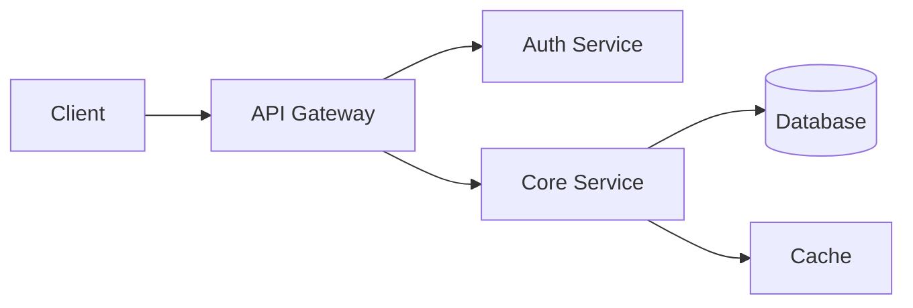

# Acme Platform

Welcome to the **Acme Platform** documentation. Acme is a cloud-native application framework for building scalable microservices. This site covers installation, configuration, API reference, and working examples.

## Quick Links

- [Getting Started](guides/getting-started.md) -- install and run your first service
- [Configuration](guides/configuration.md) -- YAML config, environment variables, and defaults
- [API Reference](reference/api.md) -- REST endpoints and data models
- [CLI Reference](reference/cli.md) -- command-line tool usage
- [Examples](examples/) -- runnable code samples

## Overview

Lorem ipsum dolor sit amet, consectetur adipiscing elit. Sed do eiusmod tempor incididunt ut labore et dolore magna aliqua. Ut enim ad minim veniam, quis nostrud exercitation ullamco laboris nisi ut aliquip ex ea commodo consequat.

Duis aute irure dolor in reprehenderit in voluptate velit esse cillum dolore eu fugiat nulla pariatur. Excepteur sint occaecat cupidatat non proident, sunt in culpa qui officia deserunt mollit anim id est laborum.

> [!NOTE]
> This documentation covers Acme Platform v3.x. For older versions, see the version selector in the sidebar.

## Platform Architecture

## Requirements

| Component | Minimum | Recommended |
|-----------|---------|-------------|
| Go | 1.22+ | 1.24+ |
| Memory | 512 MB | 2 GB |
| Disk | 1 GB | 10 GB |
| OS | Linux, macOS | Linux |
| Database | PostgreSQL 14 | PostgreSQL 16 |
