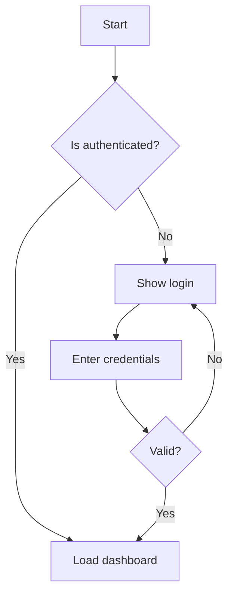
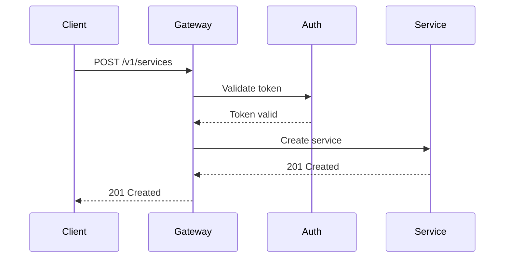

# Kitchen Sink

This page demonstrates every visual feature supported by the rendering engine.

## Typography

Regular text with **bold**, *italic*, ***bold italic***, ~~strikethrough~~, and `inline code`. Here is a [link to the home page](../README.md) and an absolute link to [Go documentation](https://go.dev/).

## Headings

All six heading levels are shown in the table of contents on the right.

### Third Level

Lorem ipsum dolor sit amet, consectetur adipiscing elit.

#### Fourth Level

Sed do eiusmod tempor incididunt ut labore et dolore magna aliqua.

##### Fifth Level

Ut enim ad minim veniam, quis nostrud exercitation.

###### Sixth Level

Duis aute irure dolor in reprehenderit in voluptate.

## Lists

### Unordered List

- Alpha item with some descriptive text
- Beta item with **bold emphasis**
  - Nested child item
  - Another nested item
    - Deeply nested item
- Gamma item with `inline code`

### Ordered List

1. First step in the process
2. Second step with a longer description that wraps across multiple lines to test line wrapping behavior in the rendered output
3. Third step
   1. Sub-step A
   2. Sub-step B
4. Fourth and final step

### Task List

- [x] Design the data model
- [x] Implement the REST API
- [ ] Write integration tests
- [ ] Deploy to staging
- [ ] Performance benchmarks

## Code Blocks

### Go

```go
package main

import (
    "context"
    "fmt"
    "log/slog"
    "os"
    "time"
)

// Processor handles incoming events with configurable concurrency.
type Processor struct {
    workers  int
    queue    chan Event
    logger   *slog.Logger
}

// NewProcessor creates a processor with the given worker count.
func NewProcessor(workers int) *Processor {
    return &Processor{
        workers: workers,
        queue:   make(chan Event, workers*10),
        logger:  slog.New(slog.NewJSONHandler(os.Stdout, nil)),
    }
}

// Run starts all workers and blocks until the context is cancelled.
func (p *Processor) Run(ctx context.Context) error {
    for i := range p.workers {
        go p.worker(ctx, i)
    }
    <-ctx.Done()
    return ctx.Err()
}

func (p *Processor) worker(ctx context.Context, id int) {
    for {
        select {
        case <-ctx.Done():
            return
        case evt := <-p.queue:
            start := time.Now()
            if err := evt.Process(); err != nil {
                p.logger.Error("processing failed",
                    slog.Int("worker", id),
                    slog.Any("error", err))
                continue
            }
            p.logger.Info("event processed",
                slog.Int("worker", id),
                slog.Duration("elapsed", time.Since(start)))
        }
    }
}
```

### Python

```python
from dataclasses import dataclass
from typing import Optional
import asyncio
import httpx

@dataclass
class ServiceConfig:
    name: str
    endpoint: str
    timeout: float = 30.0
    retries: int = 3

async def health_check(config: ServiceConfig) -> dict:
    """Check the health of a service endpoint."""
    async with httpx.AsyncClient(timeout=config.timeout) as client:
        for attempt in range(config.retries):
            try:
                resp = await client.get(f"{config.endpoint}/health")
                resp.raise_for_status()
                return {"status": "healthy", "data": resp.json()}
            except httpx.HTTPError as e:
                if attempt == config.retries - 1:
                    return {"status": "unhealthy", "error": str(e)}
                await asyncio.sleep(2 ** attempt)
```

### Shell

```bash
#!/usr/bin/env bash
set -euo pipefail

# Deploy a service to the staging environment
deploy_staging() {
    local service_name="$1"
    local version="${2:-latest}"

    echo "Deploying ${service_name}:${version} to staging..."

    docker build -t "registry.acme.io/${service_name}:${version}" .
    docker push "registry.acme.io/${service_name}:${version}"

    kubectl set image "deployment/${service_name}" \
        "app=registry.acme.io/${service_name}:${version}" \
        --namespace=staging

    kubectl rollout status "deployment/${service_name}" \
        --namespace=staging --timeout=120s

    echo "Deployment complete."
}

deploy_staging "$@"
```

### SQL

```sql
CREATE TABLE services (
    id          UUID PRIMARY KEY DEFAULT gen_random_uuid(),
    name        VARCHAR(63) NOT NULL UNIQUE,
    endpoint    TEXT NOT NULL,
    status      VARCHAR(20) NOT NULL DEFAULT 'active',
    config      JSONB NOT NULL DEFAULT '{}',
    created_at  TIMESTAMPTZ NOT NULL DEFAULT now(),
    updated_at  TIMESTAMPTZ NOT NULL DEFAULT now()
);

CREATE INDEX idx_services_status ON services (status);
CREATE INDEX idx_services_name ON services (name);

-- Find all active services updated in the last 24 hours
SELECT name, endpoint, updated_at
FROM services
WHERE status = 'active'
  AND updated_at > now() - INTERVAL '24 hours'
ORDER BY updated_at DESC;
```

### YAML

```yaml
apiVersion: apps/v1
kind: Deployment
metadata:
  name: acme-service
  labels:
    app: acme
spec:
  replicas: 3
  selector:
    matchLabels:
      app: acme
  template:
    spec:
      containers:
        - name: app
          image: registry.acme.io/service:v3.2.0
          ports:
            - containerPort: 9090
          resources:
            limits:
              memory: "512Mi"
              cpu: "500m"
```

### JSON

```json
{
  "service": {
    "name": "payment-gateway",
    "version": "3.2.0",
    "endpoints": [
      { "path": "/v1/charge", "method": "POST" },
      { "path": "/v1/refund", "method": "POST" },
      { "path": "/v1/status/:id", "method": "GET" }
    ]
  }
}
```

## Tables

### Simple Table

| Method | Endpoint | Description |
|--------|----------|-------------|
| GET | `/v1/services` | List all services |
| POST | `/v1/services` | Register a new service |
| GET | `/v1/services/:id` | Get service details |
| PUT | `/v1/services/:id` | Update a service |
| DELETE | `/v1/services/:id` | Remove a service |

### Aligned Table

| Setting | Type | Default | Notes |
|:--------|:----:|--------:|:------|
| `port` | int | 9090 | Must be 1-65535 |
| `host` | string | 0.0.0.0 | Bind address |
| `timeout` | duration | 30s | Request timeout |
| `max_conns` | int | 100 | Maximum connections |
| `tls_enabled` | bool | false | Enable HTTPS |

## Blockquotes

> Lorem ipsum dolor sit amet, consectetur adipiscing elit. Sed do eiusmod tempor incididunt ut labore et dolore magna aliqua. Ut enim ad minim veniam, quis nostrud exercitation ullamco laboris.

> "Any sufficiently advanced technology is indistinguishable from magic."
> -- Arthur C. Clarke

## Admonitions

All five admonition types:

> [!NOTE]
> Notes provide additional context or background information that supplements the main text. They are non-critical but helpful for deeper understanding.

> [!TIP]
> Tips offer practical suggestions or shortcuts that can improve the reader's workflow. Use `acme config dump --format json` to export configuration as JSON instead of YAML.

> [!WARNING]
> Warnings alert the reader to potential pitfalls or non-obvious consequences. Changing the `database.driver` after initial setup requires a full data migration.

> [!CAUTION]
> Cautions indicate actions that could cause data loss, security issues, or service disruption. Running `acme migrate down` in production will drop tables and permanently delete data.

> [!IMPORTANT]
> Important callouts highlight critical information that the reader must not overlook. API tokens are scoped to a single namespace. Cross-namespace access requires a separate token with elevated privileges.

## Color Chips

The Acme brand palette uses the following colors:

- Primary: `#2563EB`
- Secondary: `#7C3AED`
- Success: `#16A34A`
- Warning: `#EAB308`
- Error: `#DC2626`
- Neutral: `#6B7280`
- Background light: `#F8FAFC`
- Background dark: `#0F172A`

## Horizontal Rules

Content above the rule.

---

Content below the rule.

## Images

Images are not included in this test site, but the syntax is supported:

``

## Math (KaTeX)

Inline math: $E = mc^2$

Block math:

$$
\int_{-\infty}^{\infty} e^{-x^2} dx = \sqrt{\pi}
$$

The quadratic formula:

$$
x = \frac{-b \pm \sqrt{b^2 - 4ac}}{2a}
$$

## Mermaid Diagrams

### Flowchart



### Sequence Diagram



## Footnotes and Inline HTML

This is a paragraph with <mark>highlighted text</mark> and a <kbd>Ctrl</kbd>+<kbd>C</kbd> keyboard shortcut.

Abbreviations like HTML and CSS are commonly used in web development. The `<abbr>` tag can provide expansions: <abbr title="Hypertext Markup Language">HTML</abbr>.

## Long Paragraph

Lorem ipsum dolor sit amet, consectetur adipiscing elit. Pellentesque habitant morbi tristique senectus et netus et malesuada fames ac turpis egestas. Vestibulum tortor quam, feugiat vitae, ultricies eget, tempor sit amet, ante. Donec eu libero sit amet quam egestas semper. Aenean ultricies mi vitae est. Mauris placerat eleifend leo. Quisque sit amet est et sapien ullamcorper pharetra. Vestibulum erat wisi, condimentum sed, commodo vitae, ornare sit amet, wisi. Aenean fermentum, elit eget tincidunt condimentum, eros ipsum rutrum orci, sagittis tempus lacus enim ac dui. Donec non enim in turpis pulvinar facilisis. Ut felis. Praesent dapibus, neque id cursus faucibus, tortor neque egestas augue, eu vulputate magna eros eu erat. Aliquam erat volutpat. Nam dui mi, tincidunt quis, accumsan porttitor, facilisis luctus, metus.
